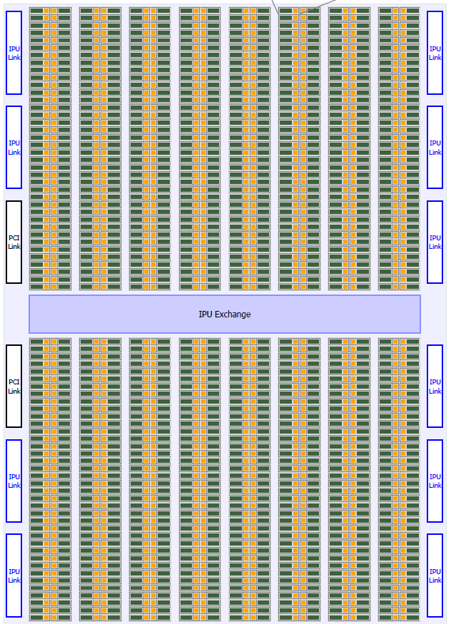
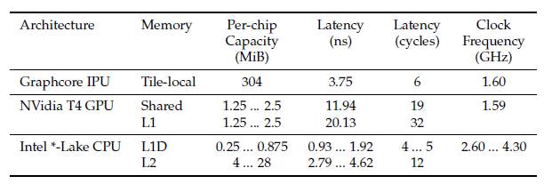

## Notes

* Designed for AI workloads. Therefore, it's aim is the efficient execution of **fine-grained** operations across a relatively large number of parallel threads.
* MIMD (Multiple Instruction Multiple Data) parallelism.
* 1216 tiles. Each tile consists of a processor and its local memory (256 KiB).304 MB total memory.
* Contains **exchange** interconnect for low-latency communication **among tiles**.
* Contains **IPU-Link** interconnect for low-latency communication **between IPUs**.
* Can efficiently run applications that have **irregular and sparse data access patterns** and control flow.
* Each thread can have completely distinct code and execution flow without incurring performance penalties (unlike GPUs).

### CPU

* Sophisticated latency-reducing techniques like branch prediction, branch
speculation, and out-of-order execution.
* Deep memory hierarchy containing multiple levels of caches, together with prefetching and sophisticated prefetch predictors.

### GPU

* Do not typically offer branch speculation, sophisticated branch prediction,
out-of-order execution, or hardware prefetching.
* SIMT execution.
* Hides memory latency with the oversubscription of threads to cores and the ability to inexpensively switch among threads. When a warp of threads is awaiting operands from main memory, the hardware can suspend them and switch to another warp that has received its operands from memory and is ready to continue.
* GPUs pay a performance penalty when threads diverge in their control flow.
* Excel at regular, dense, numerical, data-flow-dominated workloads that naturally lead to coalesced accesses and a coherent control flow.

### IPU

* Large core counts (1216 per processor) and cores are complex enough to be capable of executing completely distinct programs.
* **No shared memory**. Memories are local to cores. Each tile contains 256 KiB (304 MB total memory). 
* IPU memories are **scratchpads**. Offers theoretical 45 TB/s bandwidth and lower latency (6 clock cycles) than DRAMs.
* It pays **no penalty for running disjoint instruction flows that exhibit uncorrelated memory accesses**. This makes IPUs more efficient than GPUs at
executing applications with irregular or random data access patterns and/or
applications that are control-flow dominated.
* Each tile supports 6 hardware threads. Therefore, an IPU supports 1216 * 6 = 7296 threads.
* IPUs outperform GPUs on a per-board comparison when operands fit in memory for regular applications.
* Has Accumulating Matrix Product (AMP) units that are present in each IPU tile. AMP unit are used to accelerate matrix multiplication and convolution.

* A system with multiple IPUs exposes the single IPU devices independently, but it also exposes Multi-IPUs. A Multi-IPU is a virtual IPU device that is comprised of multiple physical IPUs and offers all their memory and compute resources **as if they belonged to a single device**.
* Software designers can scale their applications to multiple IPUs with **no additional development effort** because the same APIs can target physical IPUs or Multi-IPUs indifferently.
* Each board is connected to peer boards via IPU links and to its host system
via PCIe interfaces. The 2 IPUs on each board are connected by three links with a nominal bidirectional bandwidth of 64 GB/s each, two of which reserved for intra-board transfers.
* Uses BSP (Bulk-Synchronous) model. Computation -> Communication -> Synchronization in each superstep.
* IPU cores **can only access directly local memories**; this organization naturally enforces the local restriction of the computation phase.
* The on-chip exchange provides native hardware support and acceleration for the all-to-all exchanges of the communication phase.
* It provides support for synchronization as well.
* Programmers describe computation as vertices, data as tensors and data exchanges as static edges, without having to worry about allocation of data at rest in local memories, allocation of input/output transfer buffers, or scheduling of transfers. Compiler does all these.