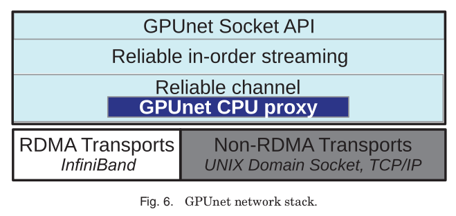

# GPUnet: Networking Abstractions for GPU Programs

Mark Silberstein, Sangman Kim, Seonggu Huh, Xinya Zhang, Yige Hu, Amir Wated, and Emmett Witchel. 2016. GPUnet: Networking Abstractions for GPU Programs. ACM Trans. Comput. Syst. 34, 3, Article 9 (September 2016), 31 pages. DOI:https://doi.org/10.1145/2963098

## Notes

* A native GPU networking layer that provides a socket abstraction and high-level networking APIs for GPU programs.
* Accommodates parallelism at the API level by providing coalesced calls invoked by multiple GPU threads at the same point in data-parallel code.
* **Deamon Architecture**: GPU handles multiple independent requests without having to batch them first.
* **Independent Architecture**: Each threadblock acts as an independent server, accepting, computing, and responding to requests.
* I/O activity on a GPU reduces the GPU’s computing capacity.
* Requires applications to invoke its API at the granularity of a single thread-block.
* Building a high-performance GPU network stack requires offloading nontrivial packet processing to NIC hardware.
* The NIC performs all low-level packet management tasks, assembles application-level messages, and stores the messages directly in application memory, ready to be delivered to an application memory buffer without additional processing.
* **Channel**: RDMA connection. 
* The CPU processes all channel creation related requests (e.g., bind), allowing GPU network applications to share the OS network namespace with CPU applications. Once the channel has been established, the CPU steps out of the way, allowing the GPU socket to manage the network buffers as it sees fit.
* Maps streams one-to-one onto RDMA channels.

```C++
__global__ void increment(int socket_number) {
    __shared__ float buffer[NUM_THREADS];
    size_t len = NUM_THREADS * sizeof(float);

    grecv(socket_number, buffer, len);

    buffer[thread_id]++;

    gsend(socket_number, buffer, len);
}
```

* Per-stream channels allow GPUnet to offload message dispatch to the highly scalable NIC hardware. The NIC is capable of maintaining a large number of channels associated with one or more memory buffers.



* Has a drop-in replacement for sockets (via LD_PRELOAD) that provides a simple way to use RDMA over InfiniBand.
* They drop the bomb in page 13. "Certain limitations of the existing software and hardware force us to deviate from the original design in which the HCA is controlled entirely from the GPU and instead fall back to using the CPU to assist with send/receive operations". Apparently, we still need to use CPU. 