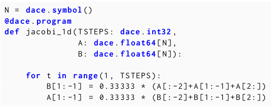

# Productivity, Portability, Performance: Data-Centric Python

Ziogas, Alexandros Nikolaos, et al. "Productivity, Portability, Performance: Data-Centric Python." arXiv preprint arXiv:2107.00555 (2021).

## Notes

* I would recommend reading the [previous paper](../Stateful-Dataflow-Multigraphs-A-Data-Centric-Model-for-Performance-Portability-on-Heterogeneous-Architectures) before reading this paper.
* 3Ps: Productivity, Portability, Performance

**Productivity**: Provides a methodology to translate Python code to a data-centric IR, and extensions to improve said conversion via explicit annotation.

**Portability**: Automatic optimizations for CPU, GPU and FPGA.

**Performance**: Automatic MPI transformations and communication optimizations. It also facilitates explicit distribution management.

* Uses decorators to get dataflow graph.
* dace = **DA**ta **CE**ntric.

* Parses Python code and converts it to SDFGs on a per function basis.
* SDFGs should be statically typed.



* For parametric parallelism, either use dace.map or DaCe provides LoopToMap transformation on IR.

SDFG generation from a Python program:

```Python
@dace.program
def gemm (alpha, beta, C, A, B):
    C[:] = alpha * A @ B + beta * C
```

First pass traverses Python AST

```Python
tmp0 = alpha * A
tmp1 = tmp0 @ B
tmp2 = beta * C
C = tmp1 + tmp2
```

