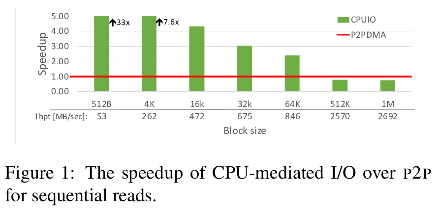
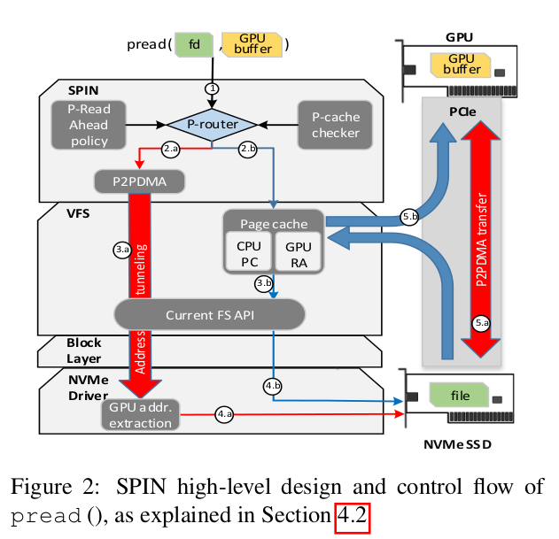
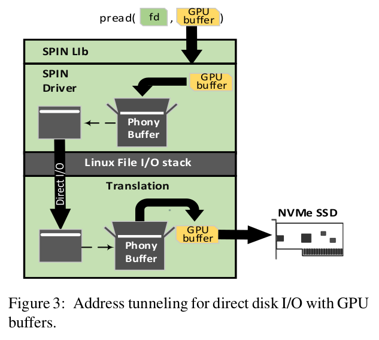

# SPIN: Seamless Operating System Integration of Peer-to-Peer DMA Between SSDs and GPUs

Bergman, Shai & Brokhman, Tanya & Cohen, Tzachi & Silberstein, Mark. (2019). SPIN: Seamless operating system integration of peer-to-peer DMA between SSDs and GPUs. ACM Transactions on Computer Systems. 36. 1-26. 10.1145/3309987.

## Notes

* Integrates P2P into the file I/O layer in the OS.
* Implements automatic toggling between Peer-to-Peer Direct Memory Access (P2P) and CPU-mediated I/O.
* Programmer uses **pread** and **pwrite** as usual and SPIN activates P2P when necesrray.
* Combines page cache and P2P (reads pages from page cache when it makes sense).
* Its read-ahead mechanism uses CPU page cache pages to store the contents of prefetched data for GPU reads. 
* Prevents page cache pollution by maintaining a separate GPU read-ahead eviction policy that restricts the space used for prefetched contents.

### P2P Shortcomings

* P2P is inefficient for short sequential reads.

* P2P is significantly slower than CPU-mediated I/O if the file contents are cached in the page cache, as is often the case for complex software
systems with multiple cooperating applications. 

**Example**: Consider a central log server that receives logs from other machines over the network and stores them locally. A log scanner invoked as another application might analyze the logs later to detect suspicious events. Using P2P might seem viable choice. However, if the scanner is invoked immediately after the files are updated, the contents might still
be in the page cache, thus using P2P would reduce system throughput.

* No standard OS API for accesing files with P2P.
* Updates written to a file via regular FS API will be stored in the page cache first, and might remain invisible to the P2P unless the file contents are written back to the disk.
* P2P requires both the source and destination to be aligned according to
device-specific rules.

### Design Considerations

**Page cache in GPU memory**: Modern GPUs do not support anonymous memory that does not belong to any CPU process. Because of that previous works usually implement a per-app page cache which disappears when the app terminates. A daemon could be implemented but it is not safe since they expose the whole page cache to all running GPU tasks. So, authors conclude that page cache in GPU memory is not practical.

**Reusing contents from the CPU page cache**: Reading from page cache is faster than P2P. If part of the pages can be read from page cache, there needs to be a mechanism to calculate whether this would increase the performance.

**Read-ahead mechanism**: This prefetches the file so that when it is subsequently accessed, its contents are read from the memory rather than from a disk, resulting in much lower file access latencies. P2P bypasses this mechanism. The authors introduce a new read-ahead mechanism: P-readahead.

### Flow

* User allocates GPU buffer for destination.
* To make GPU buffers accessible to I/O calls, the user maps the buffers into the CPU process address space.
* P-router inspects every I/O request. 
* P-router invokes P-readahead mechanism which identifies sequential access pattern and prefetches file contents into a GPU read-ahead partition.
* P-router checks with P-cache whether the request can be served from the page cache.
* To invoke P2P via direct disk I/O interface, P-router employs an address tunneling mechanism which delivers the GPU address through unmodified VFS stack and block layers down to the generic NVMe driver.

The rest is implementation details and results on benchmarks.