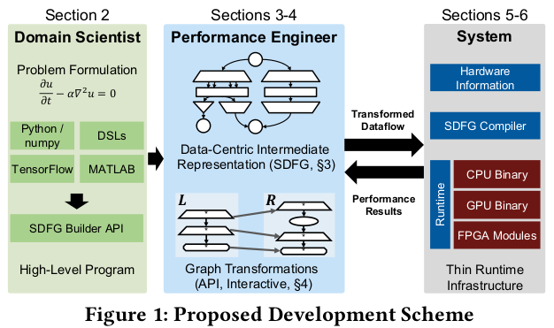

# Stateful Dataflow Multigraphs: A Data-Centric Model for Performance Portability on Heterogeneous Architectures

Ben-Nun, Tal, et al. "Stateful dataflow multigraphs: A data-centric model for performance portability on heterogeneous architectures." Proceedings of the International Conference for High Performance Computing, Networking, Storage and Analysis. 2019.

## Notes

* **Performance Portable** means: Domain scientist's view does not change while the code is optimized to different target architectures.
* It bases on the observation that data-movement dominates time and energy in today’s computing systems.
* Extends existing data-centric mappers with:
    - A multi-level visualization of data movement
    - Code transformation and compilation for heterogeneous targets 
    - Strict separation of concerns for programming roles.

1. The domain programmer works in a convenient and well-known language such as Python. 
2. The compiler transforms the code into an SDFG.
3. Performance engineer works on SDFG, specifying transformations that match certain data-flow structures on all levels (from registers to inter-node communication) and modify them.