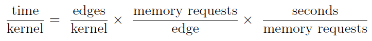

# GAIL: The Graph Algorithm Iron Law
Reference: Scott Beamer, Krste Asanović, and David Patterson. 2015. GAIL: the graph algorithm iron law. In Proceedings of the 5th Workshop on Irregular Applications: Architectures and Algorithms (IA3 ’15). Association for Computing Machinery, New York, NY, USA, Article 13, 1–4. DOI:https://doi.org/10.1145/2833179.2833187

## Learn more about the followings:
* Vertex-centric applications with irregular access patterns and asymmetric convergence.

## Questions:
* What does graph-parallel computation mean? 

It is similar to data-parallel computation. In data-parallel computation, we process **independent data** on **seperate resources**. In grap-parallel computation, we partition the graph data (**dependent**) across processing resources and then resolve the dependencies through iterative computation. 

## Notes:

* Algorithm is the most important factor for performance.
* The memory bottleneck is due to **memory latency** much more often than it is due to **memory bandwidth** because memory bandwidth is typically underutilized.
* Improving cache hit rates results in memory bandwidth becoming further underutilized.
* The most important architectural features affecting graph processing execution are **cache effectiveness** and **memory bandwidth utilization**.

Three characteristics that are most relevant for graph algorithm performance:
1. Algorithm Efficiency (Number of traversed edges ~ First Term in the formula)
2. Cache Effectiveness (Number of memory requests per traversed edge ~ Second Term in the formula)
3. Memory Bandwidth Utilization (Inverse bandwidth ~ Third Term in the formula)

* Unused prefetches will consume memory bandwidth, but a reasonably designed system will give cache misses priority over the hardware prefetcher.
