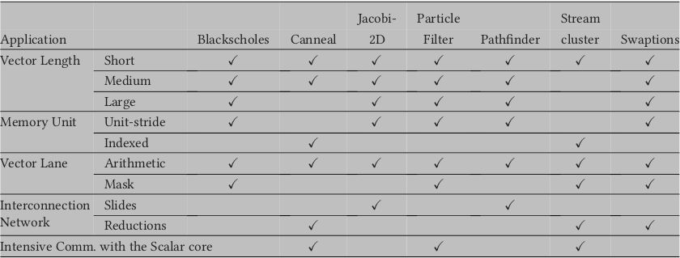

# A RISC-V Simulator and Benchmark Suite for Designing and Evaluating Vector Architectures

Ramírez, Cristóbal, et al. "A RISC-V Simulator and Benchmark Suite for Designing and Evaluating Vector Architectures." ACM Transactions on Architecture and Code Optimization (TACO) 17.4 (2020): 1-30.

## What

A RISC-V simulator and a benchmark suite for vector architectures.

## Why

Vector architectures lack tools for research.

## How

They extend gem5.

## Notes

- Two variants of SIMD: multimedia extensions and vector architectures.
  - **Multimedia extensions**: Allows executing a set of predefined operations over vector registers of a **fixed length**. Intel x86’s MMX, SSE, AVX, AVX2 and AVX-512, MIPS’s MSA, ARM’s NEON.
  = **Vector architectures**: No single preffered vector length. Just define maximum length. NEC and CRAY, and the new vector extensions ARM’s SVE and RISC-V V extension.  
- Decoupling between the vector memory unit and the vector execution unit facilitates the dynamic tolerance of memory latency. 
- Decoupling between the vector and scalar execution units allows scalar execution to run ahead.
- Vectorized benchmark suite apps:
  - Blackscholes
  - Canneal
  - Jacobi-2D
  - Particle Filter
  - Pathfinder
  - Streamcluster
  - Swaptions

