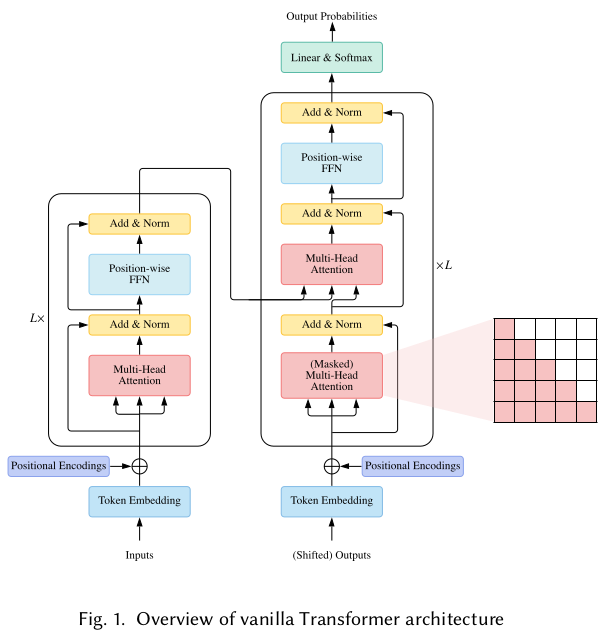
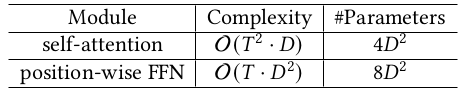
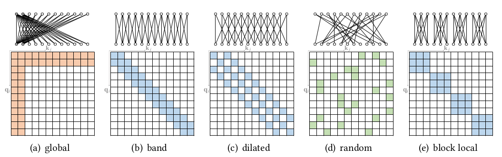
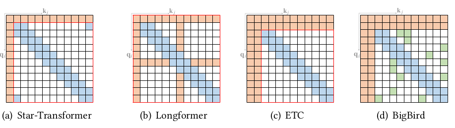

# A Survey of Transformers

Lin, Tianyang, et al. "A survey of transformers." arXiv preprint arXiv:2106.04554 (2021).

## Notes

* Encoder self attention: Q = K = V = X where X is the output of the previous layer
* Decoder self attention (aka autoregressive, aka causal attention): Queries at each position can only attend to all key-value pairs up to and including that position. 
* Decoder cross attention: Queries are from the previous decoder layer. Keys and values are coming from encoder output.

* Three ways to use:
  * Encoder-decoder: Seq-to-seq (e.g. machine translation). BART, T5, Switch Transformer.
  * Encoder only: Classification, sequence labeling etc. BERT, Roberta, BigBird
  * Decoder only: Sequence generation, language modeling etc. GPT, GPT-2, GPT-3

* Sparse Attention: Star-Transformer, Longformer, BigBird, Sparse Transformer, BP-Transformer, Image Transformer, Axial Transformer, Routing Transformer, Reformer, 
* Linearized Attention: Linear Transformer, Performer

