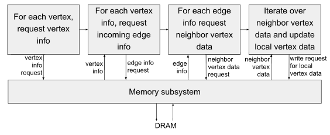
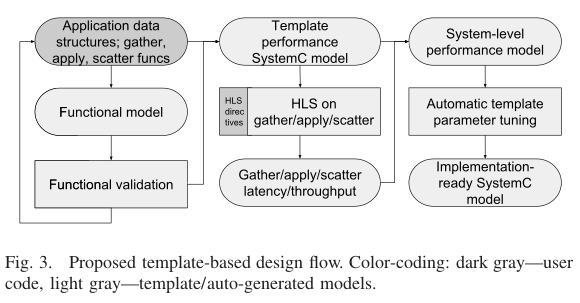

# A Template Based Design Methodology for Graph Parallel Hardware Accelerators

Reference: A. Ayupov, S. Yesil, M. M. Ozdal, T. Kim, S. Burns and O. Ozturk, "A Template-Based Design Methodology for Graph-Parallel Hardware Accelerators," in IEEE Transactions on Computer-Aided Design of Integrated Circuits and Systems, vol. 37, no. 2, pp. 420-430, Feb. 2018.
doi: 10.1109/TCAD.2017.2706562

## Learn more about the followings:
* IBM's wire-speed processor.
* Bulk-synchronous models.

## Questions:
Why should I choose this template based design methodology over RTL or HLS?

* RTL-based design **takes weeks or months** of development time to obtain accurate **power**, **perfomance** and **area estimation** for one application. If there are many applications to analyze, it is not wise to choose RTL-based design.
* HLS is effective for applications with **regular compute patterns**.

## Notes:
Graph analysis is different from traditional grid based high performance computing because of:
* Irregular communication
* Little data locality
* Low computation to communication ratio
* Frequent synchronization requirements
* Hard-to-predict work assignment.

Performance bottleneck for of big data graph applications typically the **DRAM access latency** due to **low compute-to-memory ratios** and **random memory access patterns**.

Most previous works on hardware accelerators assume that data resides in local memory with fixed latency. This is ensured by processing one partition at a time and overlapping **computation of the current partition** with the **communication of the next partition**. This is impractical for big data apps due to poor temporal/spatial locality.

* Due to aforementioned reasons, an accelerator for graph apps is expected to generate many concurrent DRAM requests to fully utilize DRAM bandwidth. 

### Contributions
1. Shows the limitations of HLS-based accelerator design methodologies for **irregular graph algorithms**.
2. Proposes a template-based methodology for **iterative graph algorithms**.
3. Proposes a design-space exploration algorithm for graph accelerators.
4. Provides a power, performance and area comparison of graph accelerators for three different applications. The comparison is done between hardware generated by: 
    * HLS methodology using traditional bulk-synchronous models.
    * Proposed templated-based methodology.
    * A state of art CPU system.

### Background
Efficient execution of a graph algorithm requires both **high throughput computation** and **work efficiency**.

**Throughput**: Number of vertices or edges processed per unit time.

**Work Efficiency**: Number of vertices or edges processed to complete a given task.

Two factors that affect work efficiency of iterative graph algorithms:
1. Asynchronous Execution

In bulk-synchronous implementation of a graph algorithm, there are global barriers between iterations. Only the data from the previous iteration can be used.

In asynchronous implementation, vertices access the latest data from neighbours, allowing them to see the updates done in the same iteration.

Asynch 2x faster for some graph algorithms.

2. Active Vertex Set

Vertices converge at different speeds. Work efficiency can be improved by not processing the vertices that converge earlier than others.

### HLS Based Accelerator Design
Good for designing accelerators for **compute-oriented** applications with **regular memory access patterns**. Hard to use for irregular graph applications.

* It is not viable to store very large graphs in local memories of an accelerator.
* Processing one partition at a time is not practical due to the irregular memory access patterns. Hence, the designed accelerator needs to be **able to make requests to system memory** and be **able to hide access latency** by scheduling multiple memory requests concurrently.

Paper assumes that the input graphs are stored in CSR format. Two arrays are used to store the graph topology (**VertexInfo**, **EdgeInfo**). 

VertexInfo[i] stores: 
* Corresponding edge offset in EdgeInfo array.
* Number of incoming/outgoing edges (for directed graphs).

EdgeInfo[i] stores:
* Neighboring vertex index for edge i.

Data associated with each vertex and edge is stored in array **VertexData** and **EdgeData** respectively.

HLS model that was used in the paper supports multiple outstanding requests for MLP. Bulk synchronous model of execution was used.

The above pipeline needs to be implemented for each application **seperately**.

### Proposed Architecture
The basic idea is to allow processing many vertices/edges to be able to hide long access latencies to main memory. The accelerator is connected to the system DRAM directly. For detailed architecture check: [Preliminary Paper](../Energy-Efficient-Architecture-for-Graph-Analytics-Accelerators/README.md)

### Template Based Methodology
Template is created once and utilized across many applications. Reduces design effort.

#### Design Flow
Template comes with functional and performance SystemC models. Functional model is used to validate functionality of the application. The performance model is a **cycle-accurate** SystemC model that has all the architectural details of the template modules, except  the user-defined functions.

1. User specializes the template by providing **application specific data types** and **implementation of some predefined functions** in C.
2. User provides **HLS directives** for the application specific functions.
3. Once the template is specialized, an HLS flow is used to generate RTL for the user-defined functions for timing characterization. After the latency and throughput values for each user func are computed, they are back annotated into the performance models to produce a system level performance model for this accelerator.
4. This model is then used for design space exploration.
5. After automatic tuning of the template parameters, the implementation ready SystemC models can be synthesized to produce RTL using a standard HLS flow.