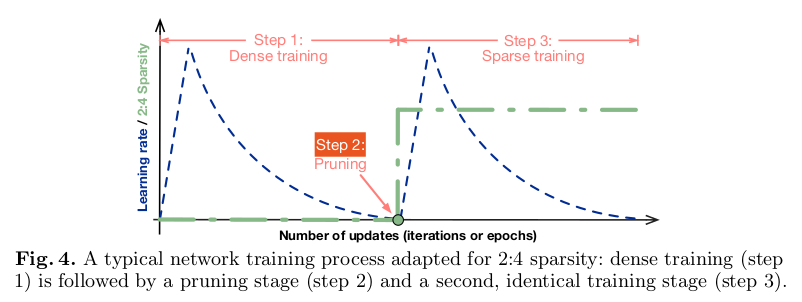

# Accelerating Sparse Deep Neural Networks

Mishra, Asit, et al. "Accelerating sparse deep neural networks." arXiv preprint arXiv:2104.08378 (2021).

## Notes

* 2:4 pattern: Requiring that every group of consecutive four values contains at least two zeros
* This workflow prunes weights of a densely-trained model once, then repeats the training session with a fixed sparsity pattern using the same hyper-parameters as in the original training session
* Structured pruning removes parameters in groups (entire filters, channels, etc.) in order to exploit hardware and software optimized for dense computation. However,at higher levels of sparsity these pruning methods lose model accuracy. For example, ResNet-50 can see a 2× speedup through channel pruning, but close to 1.5% accuracy is lost.
* The performance benefit with such unstructured pruning approaches is negligible and at times negative, even when pruning rate is high (e.g. 95%)
* Since their aim is to reduce neural network size and run-time at deployment, they trade a higher training cost for a simple and general workflow

