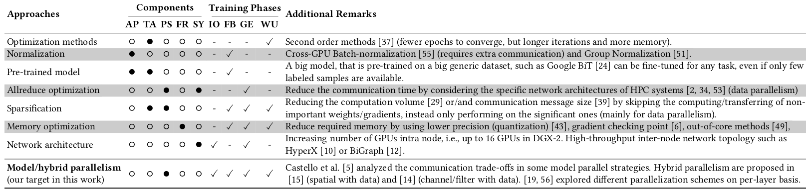

# An Oracle for Guiding Large-Scale Model/Hybrid Parallel Training of Convolutional Neural Networks

Kahira, Albert Njoroge, et al. "An Oracle for Guiding Large-Scale Model/Hybrid Parallel Training of Convolutional Neural Networks." Proceedings of the 30th International Symposium on High-Performance Parallel and Distributed Computing. 2020.

## What

An overview of large scale model/hybrid parallelism techniques.

## Why

We use distributed training to alleviate the memory capacity constraints. We need solid parallelism techniques for high performance in distributed training settings but there are many choices. 

## How

They try different strategies to detect the bottlenecks.

## Notes

- Four strategies they cover:
  - Distributing data samples (data parallelism)
  - Splitting the data sample by its spatial dimensions such as width or height (spatial parallelism).
  - Vertically partitioning the neural net along its depth (layer parallelism) and overlapping communication and computation between one layer and the next layer (pipeline parallelism).
  - Horizontally dividing the neural network in each layer by the number of input and/or output channels (channel and filter parallelism).

### Terminology

They divide DNN phases into four:

* I/O
* FB = Forward + Backward
* GE = Gradient Exchange
* WU = Weight Update

Distributed training components:

* AP = Application (Models and Datasets)
* TA = Training Algorithms (SGD, Adam etc.)
* PA = Parallel Strategies (model of computation and communication)
* FR = Framework
* SY = Systems