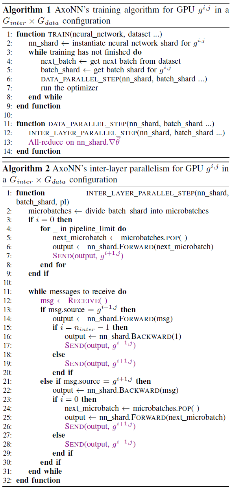

# An asynchronous message driven parallel framework for extreme scale deep learning

Singh, Siddharth, and Abhinav Bhatele. "AxoNN: An asynchronous, message-driven parallel framework for extreme-scale deep learning." arXiv preprint arXiv:2110.13005 (2021).

## Notes

* They use Cuda-aware MPI as a communication backend for P2P communication rather than NCCL because it offers higher intranode bandwidth and non-blocking primitives.
* They don't use intra layer parallelism (operator parallelism) because it requires bulk synchronous collective communication which leads to scaling bottleneck.
* They arrange GPUs in a virtual 2D grid topology. 
* GPUs in each row form a group and are used to implement inter-layer parallelism within each group.
* The groups together are used to provide data parallelism by processing different shards of a batch in parallel.

Algorithm:

