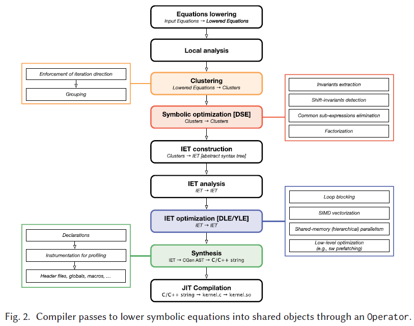

# Architecture and Performance of Devito, a System for Automated Stencil Computation

Fabio Luporini, Mathias Louboutin, Michael Lange, Navjot Kukreja, Philipp Witte, Jan Hückelheim, Charles Yount, Paul H. J. Kelly, Felix J. Herrmann, and Gerard J. Gorman. 2020. Architecture and Performance of Devito, a System for Automated Stencil Computation. ACM Trans. Math. Softw. 46, 1, Article 6 (April 2020), 28 pages. DOI:https://doi.org/10.1145/3374916

## What
Framework to generate highly optimized stencil code.

## Why
There are many optimizations that can be done and it is hard to do them manually.

## How
They take expressions written in Python and lower them to C++ code through a series of intermadiate representations.

## Notes

* It uses SymPy for the specification and manipulation of stencil expressions.

