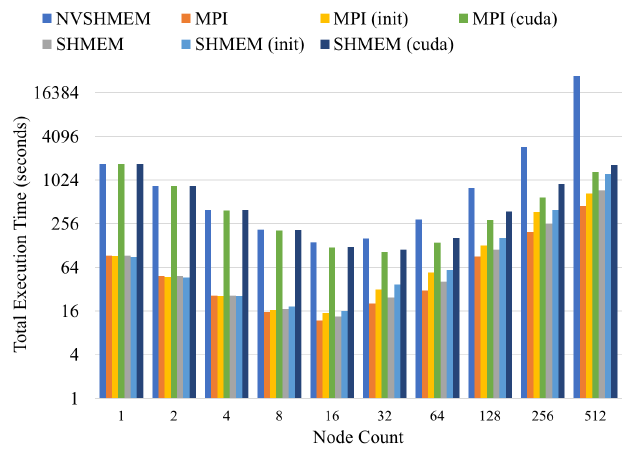
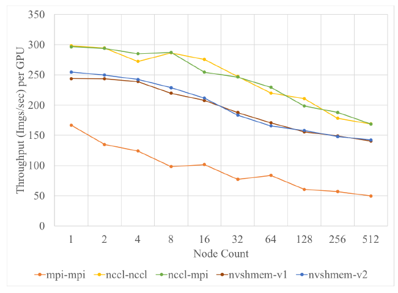

# Assessment of NVSHMEM for High Performance Computing

C. Hsu, N. Imam, A. Langer, S. Potluri and C. J. Newburn, "An Initial Assessment of NVSHMEM for High Performance Computing," 2020 IEEE International Parallel and Distributed Processing Symposium Workshops (IPDPSW), 2020, pp. 1-10, doi: 10.1109/IPDPSW50202.2020.00104.

## What
Asssesment of NVSHMEM library.

## Why
NVSHMEM is a relatively new partitioned global address space programming model. Assessing it is useful in terms of usability, functionality, and scalability.

## How
They run two math kernels, matrix multiplication and Jacobi solver, and one full application (Horovod).

## Notes

* The PE uses one and only one GPU throughout the lifetime of an NVSHMEM job.
* **nvshmem_malloc** for symmetric heap allocation, malloc for normal allocation. **nvshmem_get** and **nvshmem_put** for memory accesses on symmetric heap.
* If a CUDA kernel in a PE calls NVSHMEM synchronization routines (such as **nvshmem wait**, **nvshmem barrier**, or **nvshmem barrier all**), then it is required to
be launched using nvshmemx collective launch routine.
* One-sided remote (atomic) memory access, memory ordering, point-to-point synchronization and collectives are supported from both the host and the GPU.
* Blocking get operations are not guaranteed to be in program order in NVSHMEM. A blocking get operation returns to the destination array at the local PE, after the data has been delivered. 
* NVSHMEM relaxes the ordering requirement of get operations and requires the programmer to use a fence where such ordering is required.

GEMM implementation:

```C
int size ; // number of PEs
int rank ; // my PE id
int nb = COLUMNS / size ; // number of columns in each PE
int i_start = rank * nb; // the displacement of matrix B
double A_local [ROWS][nb], B_local [ROWS][ nb], C_local [ROWS][nb];

for (i = 0; i < ROWS ; i ++) {
    for (p = 0; p < size ; p ++) {
        // compute the partial product of c[i][j]
        for (k = 0; k < nb; k ++) {
            for (j = 0; j < nb; j ++) {
                C_local [i][j] += A_local [i][k] * B_local [ i_start + k][j];
            }
        }
        
        // send a block of matrix A to the adjacent PE
        // PE: 0 -> 1 -> 2 -> ... -> size -1 -> 0
        shmem_barrier_all ();
        shmem_double_put (&A_local [i][0] , &A_local [i][0] , nb , (rank +1) % size);
        shmem_barrier_all ();
        // reset the displacement of matrix B to the next block
        if ( i_start == 0)
            i_start = ( size - 1) * nb;
        else
            i_start = i_start - nb;
    }
}
```

4096x4096 matrix multiplication.

1. The initial data and the final data are in GPU. The computation is done by GPU. The
communication is by GPU using NVSHMEM (NVSHMEM).
2. The initial data and the final data are in CPU. The computation is done by CPU. The communication is done by CPU using MPI (MPI).
3. The initial data and the final data are in CPU. The computation is done by CPU. The communication is done by CPU using SHMEM (SHMEM).
4. The initial data and the final data are in GPU. The computation is done by GPU. The communication is done by CPU using MPI (MPI(cuda)).
5. The initial data and the final data are in GPU. The computation is done by GPU. The communication is done by CPU using SHMEM (SHMEM(cuda)).
6. The initial data and the final data are in GPU. The computation is done by CPU. The communication is done by CPU using MPI (MPI(init)).
7. The initial data and the final data are in GPU. The computation is done by CPU. The communication is done by CPU using SHMEM (SHMEM(init)).



Resnet on Imagenet with Horovod using Tensorflow v2.
