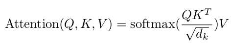
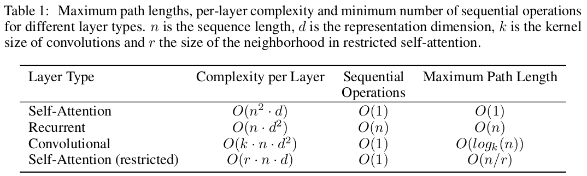

# Attention is All You Need

Vaswani, Ashish, et al. "Attention is all you need." Advances in neural information processing systems 30 (2017).

## What


Encoder-decoder architecture based on attention mechanism.

## Why

Long dependencies between elements of a sequence kills the performance.

## How

By using multiheaded attentions.

## Notes

* Attention: Instead of going through all hidden states for long dependencies (like in RNNs), directly look at the dependencies. 

```Python
def attention(query, key, value, mask)
    scores = torch.matmul(query, key.transpose(-2, -1)) / math.sqrt(self.head_dim)
    scores = scores.masked_fill(mask == 0, -1e9)
    
    attention_weights = scores.softmax(dim=-1)
    
    attention_weights = dropout(attention_weights)
    
    representations = torch.matmul(attention_weights, value)

    return representations
```



* Three multiheaded attentions:
  * Encoder self attention
  * Decoder self attention
  * Encoder-Decoder attention (K,V are from encoder output, Q from decoder)

* Instead of performing a single attention function with **dmodel** keys, values and queries, linearly project the queries, keys and values h times with different, learned linear projections to dk , dk and dv dimensions, respectively. On each of these projected versions of queries, keys and values we then perform the attention function in parallel.



* WMT14 English-German dataset
* Byte-pair encoding