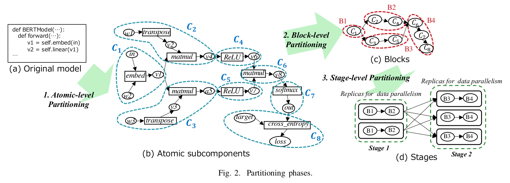

# Automatic Graph Partitioning for Very Large-scale Deep Learning

Tanaka, Masahiro, et al. "Automatic Graph Partitioning for Very Large-scale Deep Learning." arXiv preprint arXiv:2103.16063 (2021).

## Notes

* Compared with Megatron-LM and GPipe.
* Converts a model to a task graph in ONNX format where there are two types of nodes: **tasks** (rectangle) and **values** (circle).

Three steps:

1. Atomic Level Partitioning: Identify atomic subcomponents
2. Block Level Partitioning: Groups atomic subcomponents into blocks
3. Stage Level Partitioning: Groups blocks into stages.

### Atomic Level

* Every atomic subcomponent consists of one non-constant task and potentially several constant tasks (i.e., tasks that do not depend on the input to the entire model)
* To create atomic subcomponents, one forward (to find non-constant tasks) and one backward pass is needed. In backward pass, whenever you reach a non-constant task, form a new atomic subcomponent that contains the task and its output value. When you reach a constant task, put it and its output value into the subcomponent to which it is sent. 

### Block Level

Two things to consider:  

1. Balance of the blocks’ computation times
2. Communication cost

Uses k-way multilevel partitioning algorithm.

Three steps:

1. Coarsening: Iteratively merges subcomponents to produce blocks
2. Uncoarsening: Attempt to reduce communication among the blocks by adjusting the boundaries between them
3. Compaction: Tries to merge subcomponents that the coarsening step could not merge. 

Given a desired number of blocks k specified by the user, these steps finally produce k blocks.

The coarsening procedure sequentially picks a node (v) in ascending order of computation time and searches for another node (w) that satisfies the following conditions to create a new group with v and w:

* w is adjacent to v.
* The group obtained by merging v and w, denoted by v ∪ w, is convex and its memory usage is less than the accelerator’s device memory size.
* For any group that satisfies the above two conditions, the computation time of v ∪ w is smaller than that of v ∪ w'.

To obtain the computation times and memory usages, run forward and backward passes of the subcomponents multiple times and monitor the profiles.

### Stage Level

Merges blocks into a stage. Since the stages can be replicated for data parallelism, this step automatically determines an optimal number of replicas for each stage at the same time.

They aim to minimize the longest computation time among all stages.