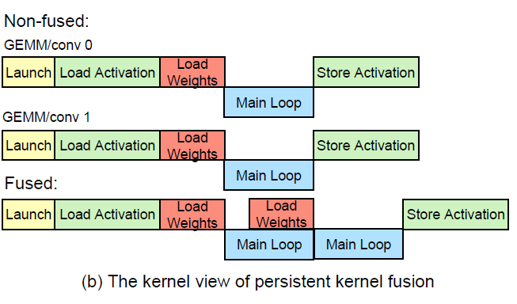

# Bolth Bridging The Gap Between Auto Tuners And Hardware Native Performance

Xing, Jiarong, et al. "Bolt: Bridging the Gap between Auto-tuners and Hardware-native Performance." arXiv preprint arXiv:2110.15238 (2021).

## Notes

* Vendor libraries (cuDNN, cuBLAS) have hardware native performance but lack customization. 
* Auto-tuners are flexible and customazible but lack hardware performance.
* Bolt is looking for best of both worlds.
* Auto-tuning takes a shit ton of time (it takes AutoTVM 10 hours on x86 CPUs and 7 days on NVIDIA GPUs to tune all workloads in the ResNet-50 model)
* Vendor libraries are increasingly templated (CUTLASS, OneDNN, ROCm), reconfigurable with declarative parameters to suit different scenarios, but exposing concise interfaces that are potentially amenable to auto-tuning. 
* Bolt operates on hardware-native templates which interposes a thin layer between the high-level computational graph and the low-level CUDA code.
* Does graph level (persistent kernel fusion), operator level (automated padding) and model level (deepening models with 1x1 Convs) optimizations.
* They should have compared Bolt with cuDNN.

### Auto-tuning

* Auto-tuners construct a cost model of the hardware via learning —e.g., by building a training set with sample programs and their performance on the target, and by predicting which implementations are likely to be performant.
* Lacks hardware native performance.
* Takes days or weeks to auto-tune.

### Templated Libraries

* Vendor libraries (cuDNN) have fixed primitives. Now, they employ templates for modularity (CUTLASS).
* CUTLASS has thread-wide, warp-wide, block-wide, and device-wide primitives.

### Bolt

* Bolt develops a new operator fusion technique that is called persistent kernel fusion (fuse multiple operators into one kernel).
* Reuses TVM frontend to parse the model into relay graph. It invokes optimizations on it and performs grap partitioning. Then, does hardware native profiling to find the best kernels for each operator.
* Fuses two or more GEMMs/Convs.
  - Eliminates memory traffic for storing and loading activations.
  - Eliminates kernel launch latency.

* CUTLASS supports only NHWC layout for Convs because it is faster than NCHW layout. But not all models are written in the desired layout —e.g., all Pytorch models use NCHW.