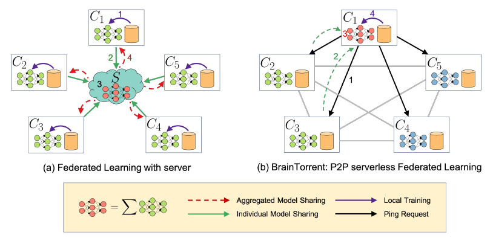
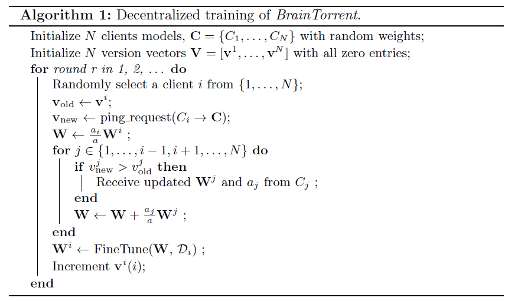

# Notes

* Challenge: Access to sufficient annotated data for medical centers.
* Solution: Learning a shared prediction model without sharing the data (Federated Learning).
* Downside: Dependence on a central server. 
* BrainTorrent solution: Get rid of the center server. Train in a P2P fashion.
* They use Multi-Atlas Labelling Challenge (MALC) dataset.
* They use QuickNAT architecture as a segmentation network.

## Flow
Each node has a vector containing its own version and the last versions of models it used during merging.

1. Locally train each node in parallel for a few iterations using the local dataset.
2. A random node initiates the training process. It sends out a ping-request to the rest to get their latest model versions to generate v_new.
3. All nodes send their weights and training sample size to the initiator.
4. This subset of models is merged with initiator's current model to a single model by weighted averaging. Then, return to step 1.

