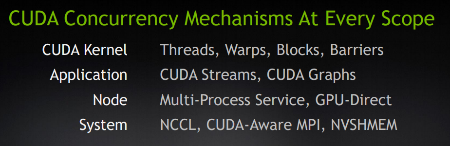
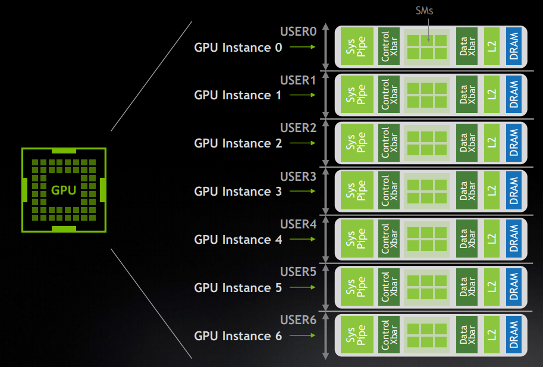
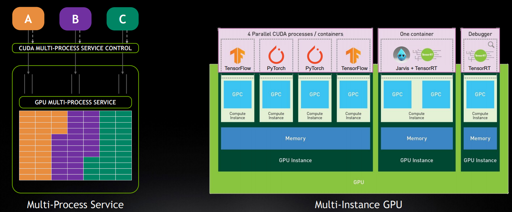
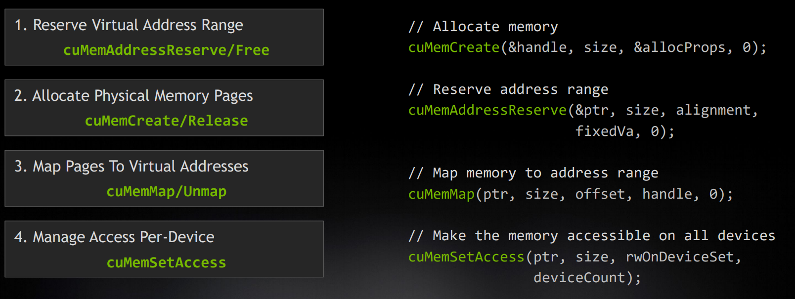
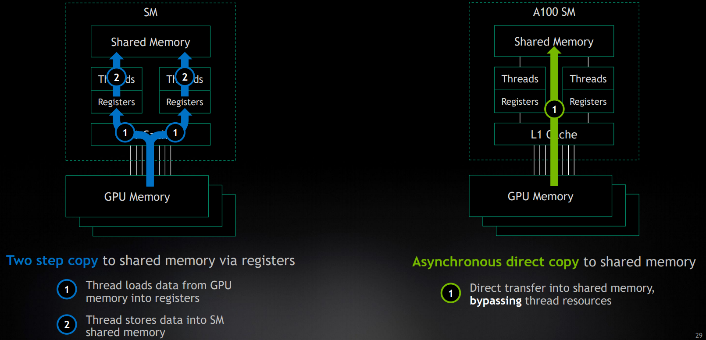

# CUDA New Features and Beyond

**Speaker**: Stephen Jones

## Concurrency Mechanisms

## Data Center GPU Manager (DCGM)

* Active health monitoring
* NVSwitch Management
* System alerts
* GPU Metrics
* Diagnostics

## Multi Instance GPU (MIG)

Comes with A100. Divides a single GPU into multiple instances each with isolated paths through the entire memory system. 

## Multi Process vs Multi Instance GPU

## CUDA Virtual Memory Management

## Fine-Grained Synchronization

## Direct Transfer into Shared Memory

