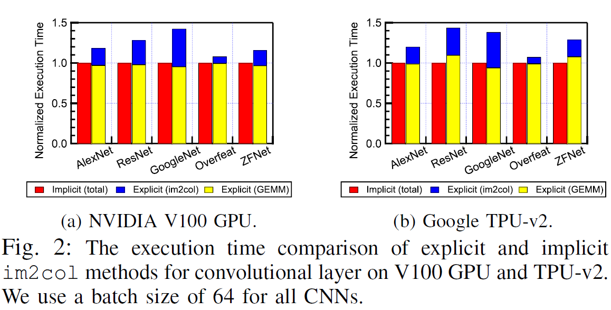
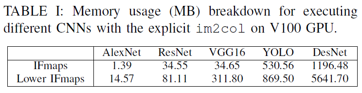

# Characterizing and Demystifying the Implicit Convolution Algorithm on Commercial Matrix-Multiplication Accelerators

Zhou, Yangjie, et al. "Characterizing and Demystifying the Implicit Convolution Algorithm on Commercial Matrix-Multiplication Accelerators." 2021 IEEE International Symposium on Workload Characterization (IISWC). IEEE, 2021.

## Notes

* Explicit im2col is 28% slower than the implicit approach on average.
* Explicit im2col requires 1.5 to 10x more memory.

