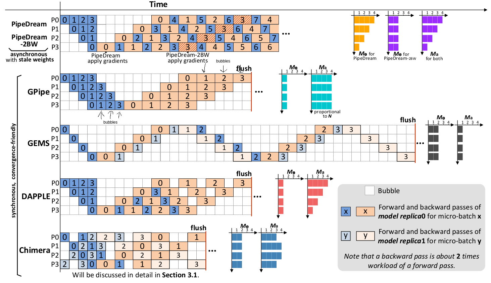
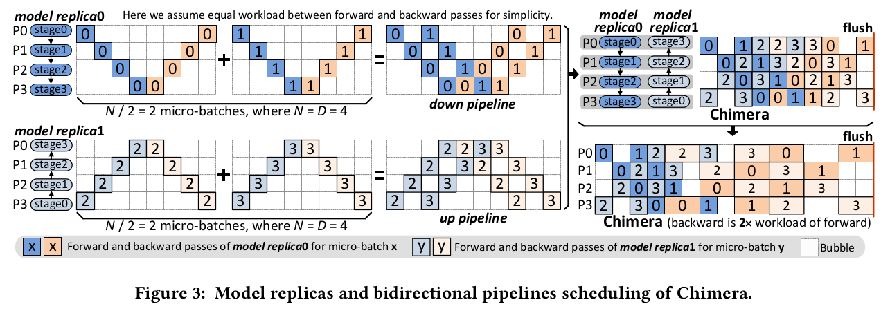

# Chimera: Efficiently Training Large-Scale Neural Networks with Bidirectional Pipelines

Li, Shigang, and Torsten Hoefler. “Chimera: Efficiently Training Large-Scale Neural Networks with Bidirectional Pipelines.” ArXiv:2107.06925 [Cs], July 2021. arXiv.org, http://arxiv.org/abs/2107.06925.

## Notes

* Memory requirements of some modern models:
  * GPT-3: 350 GB with 16 bits accuracy.
  * Switch Transformers: 6 TB
* Two ways to distribute DNN models:
  * **Operator Parallelism**: The operators of a layer can be split across multiple accelerators.
  * **Pipeline Parallelism**: The model could be distributed layer by layer. 
* Pipeline parallelism has a lower communication cost because:
  * Splitting a fully connected layer requires a communication volume of O ($n^2$ / $\sqrt{P}$) for an NxN matrix and requires two all-reduce on the output activations for each Transformer layer which take a shit tone of time.
  * Pipeline parallelism only requires point-to-point communication to transfer the output activations between pipeline stages with each stage containing a group of consecutive layers. 
* Downside of pipeline parallesm is that it suffers from bubbles or weight staleness. 
* Pipeline parallelism creates different memory requirements for each accelerator in the pipeline, even though each accelerator has an identical compute load. 
* The first accelerator of a pipeline of depth 𝐷 has to store 𝐷 such activations while the last accelerator requires memory for one. This leads to reduced performance because the micro-batch size has to be chosen to fit the first accelerator in the pipeline.

It's a bit hard to understand what they refer to as "bubbles". In ILP, it is the cycle where nothing useful happens. I assume it is the same here. They say GPipe and DAPPLE incur 2 * (D - 1) bubbles. Since D=4 in the example, we expect 6 bubbles. I put arrows to the time slots that I think are bubbles. For the forward pass, after micro batch 0 finished it waits 3 time slots until the backward pass starts. Also, it waits 3 time slots after backward finishes until the flushing. I didn't get the DAPPLE though. I am hoping that one of my lab fellows would help me understand it when we meet to discuss the paper. 

* The key idea of the paper is that they combine two pipelines in different directions. This decreases the number of bubbles. 
* Chimera can overlap computation with gradient sync which is cool.

* It also supports hybrid parallelism (pipeline + data).
* They choose params with a performance model by taking AllReduce (to synch) and P2P (between stages) communication cost into account.
* Can generalize more than two pipelines.