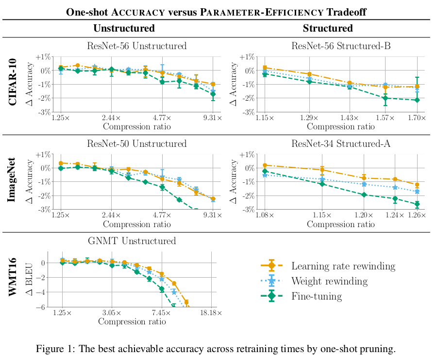
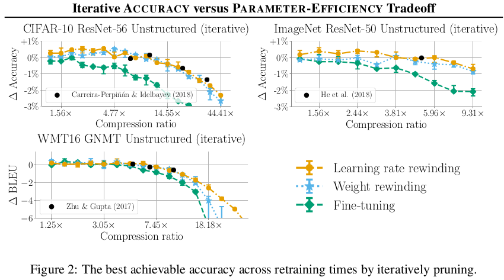
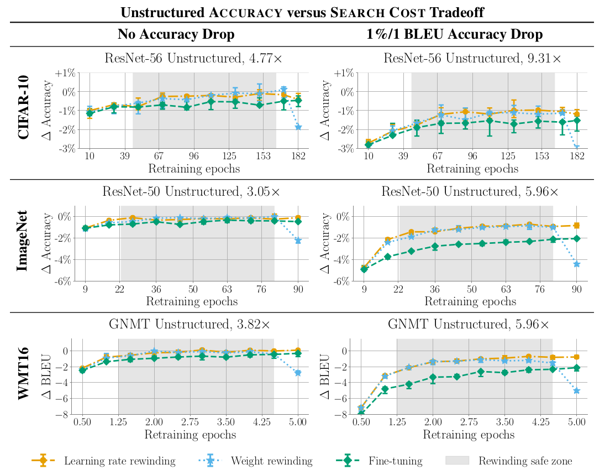
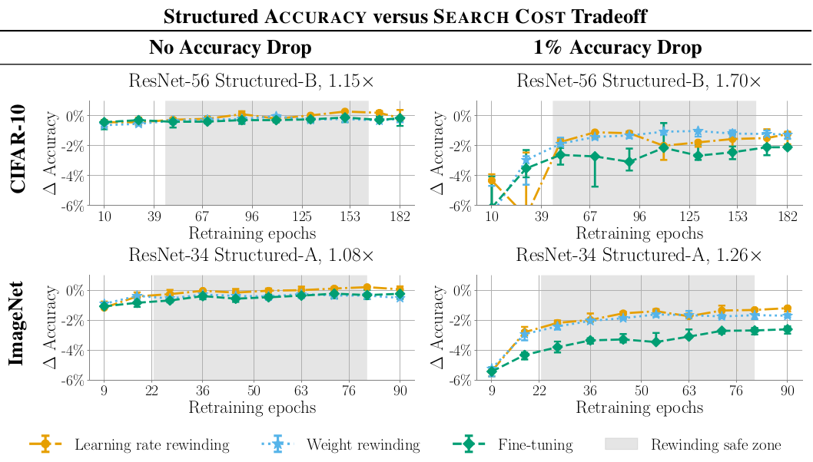

# Comparing Rewinding and Fine-tuning in Neural Network Pruning

Renda, Alex, Jonathan Frankle, and Michael Carbin. "Comparing rewinding and fine-tuning in neural network pruning." arXiv preprint arXiv:2003.02389 (2020).

## Notes
* They compare fine-tuning, weight rewinding, and learning rate rewinding.

* **Train-Prune-Fine tune Technique**: Example: Han et al, 2015
  - Train the network to completion
  - Remove unwanted structure to compress the network
  - Retrain the remaining structure with fixed small learning rate to recover lost accuracy

* **Weight Rewinding Technique**: Rewinds unpruned weights to their values from earlier in training and retrains them from there using the original training schedule. Example: Lottery Ticket Hypothesis

* **Learning Rate Rewinding Technique**: Trains the unpruned weights from their final values using the original training schedule. 

* Studies:
  - **Parameter Efficiency**: The parameter count of the pruned neural network.
  - **Search cost**: Measured as the number of epochs for which the network is retrained. 

* **Unstructured Pruning**: Prunes individual weights without consideration for where they occur within each tensor.
* **Structured Pruning**: Prunes weights in groups, removing neurons, convolutional filters, or channels.

* Unstructured pruning reduces the number of parameters, but may not improve performance on commodity hardware until a large fraction of weights have been pruned. 
* Structured pruning preserves dense computation, meaning that it can lead to immediate performance improvements.

## Accuracy VS Parameter Efficiency Tradeoff

- They study the highest accuracy each retraining technique can achieve at each compression ratio without considering the search cost.
- Weight rewinding achieves higher accuracy than fine-tuning across compression ratios on all studied networks and datasets. Learning rate rewinding matches or
outperforms weight rewinding in all scenarios. 
- With iterative unstructured pruning, learning rate rewinding achieves state-of-the-art ACCURACY versus PARAMETER EFFICIENCY tradeoffs, and weight rewinding remains close. 
- One shot pruning results:
  - Learning rate rewinding > Weight rewinding > Fine Tuning
- Iterative pruning results:
  - Learning rate rewinding > Weight rewinding > Fine Tuning

## Accuracy VS Search Cost Tradeoff

- One shot pruning results:
  - Learning rate rewinding > Weight rewinding > Fine Tuning
- Iterative pruning results:
  - Learning rate rewinding > Weight rewinding > Fine Tuning

