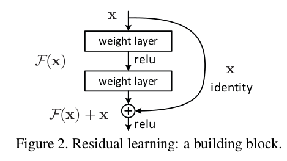
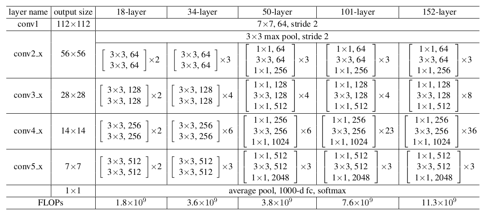

# Deep Residual Learning for Image Recognition

He, Kaiming, et al. "Deep residual learning for image recognition." Proceedings of the IEEE conference on computer vision and pattern recognition. 2016.

## Notes

* **Vanishing/exploding gradients problem**: This prevents models to converge. They solve it with normalized init, and intermediate normalization layers.

* **Degradation problem**: As depth increases, accuracy gets saturated and degrades rapidliy. They offer a deep residual framework to solve this problem. 

* The shortcut connections simply perform identity mapping, and their outputs are added to the outputs of the stacked layers.

