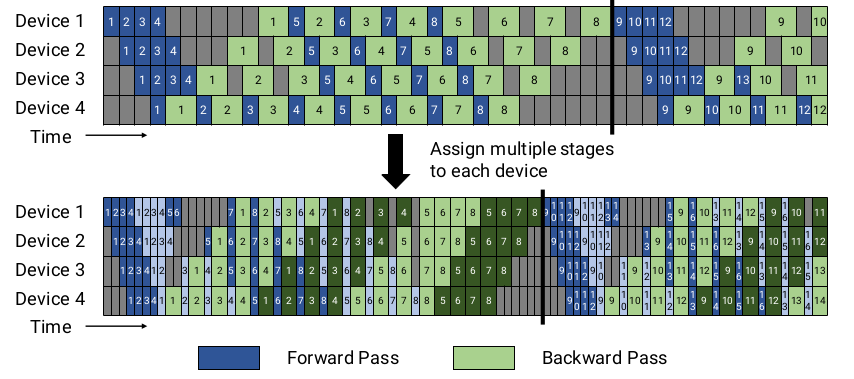

# Efficient Large-Scale Language Model Training on GPU Clusters Using Megatron-LM

Narayanan, Deepak, et al. "Efficient large-scale language model training on gpu clusters." arXiv preprint arXiv:2104.04473 (2021).

## What
A way to combine various optimizations to train very large models.

## Why
Large models give better accuracy but they don't fit into the memory of a GPU. There should be a scalable way to train these large models.

## How
They analyze the advantages and disadvantages of various parallelism types and combine them according to the results. They also propose a new scheduler based on PipieDream-Flush scheduler.

## Notes

* Tensor model parallellism works up to 20 billion parameters on DGX-2 A100 Servers (8 80 GB A100)
* Tensor model parallellism doesn't work well for multi-node (slow bandwidth and small matrix-matrix multiplications). 
* GPipe schedule: Stash activations for **m** microbatches.
* PipeDream-Flush schedule: Stash activation for **p** or fewer microbatches. PipeDream schedule limits the number of in-flight microbatches (the number of microbatches for which the backward pass is outstanding and activations need to be maintained). 
* Schedule with interleave: Each device can perform computation for multiple subsets of layers. For example, if each device had 4 layers before (i.e., device 1 had layers 1 − 4, device 2 had layers 5 − 8, and so on), we could have each device perform computation for two model chunks (each with 2 layers), i.e. device 1 has layers 1, 2, 9, 10; device 2 has layers 3, 4, 11, 12; and so on. With this scheme, each device in the pipeline is assigned multiple pipeline stages. In this way, the pipeline flush for the same batch size happens sooner.
* Schedule with interleave causes more communication.

* When considering different forms of model parallelism, tensor model parallelism should generally be used up to degree g when using g-GPU servers, and then pipeline model parallelism can be used to scale up to larger models across servers.
* When using data and model parallelism, a total model-parallel size of M = t * p should be used so that the model’s parameters and intermediate metadata fit in GPU memory; data parallelism can be used to scale up training to more GPUs.
* The optimal microbatch size 𝑏 depends on the throughput and memory footprint characteristics of the model, as well as the pipeline depth p, data-parallel size d, and batch size B.
