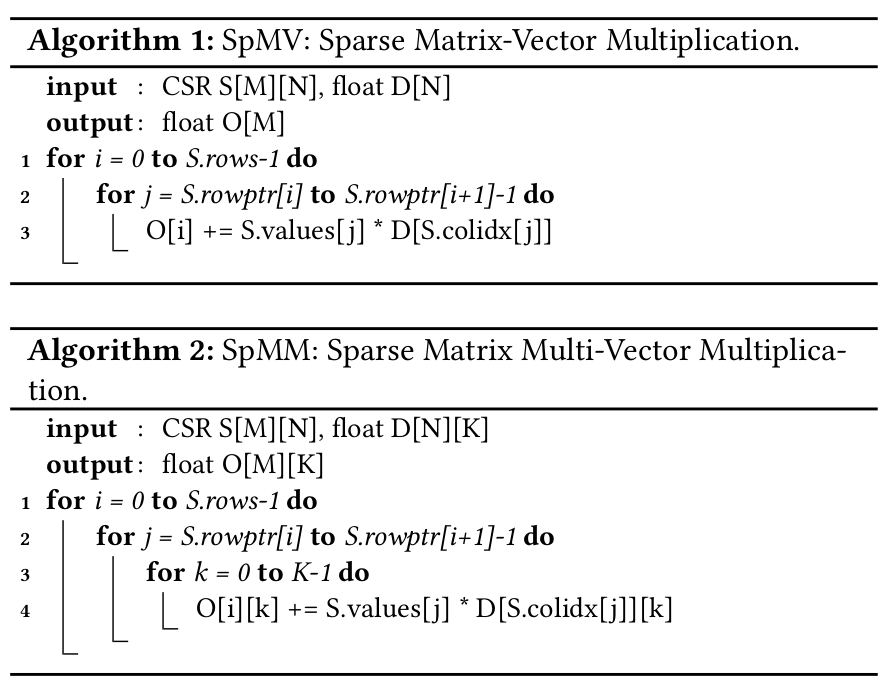
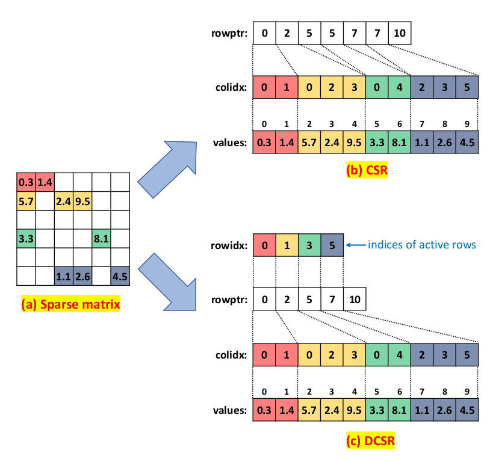

# Efficient Sparse-Matrix Multi-Vector Product on GPUs

## Notes

* SpMM implementations: cuSPARSE, MAGMA, CUSP.
* For single precision NxN sparse matrix SpMV
  * CSR requires: 8 × nnz + 4 × (N + 1) bytes of storage.
  * The total memory footprint of SpMV is: 8 × nnz + 12 × N + 4 bytes.
  * Total floating point operation count is 2 * nnz: one multiply-add operation for each non-zero element in the sparse matrix.
* For SpMM:
  * The total memory footprint of SpMM: 8 × nnz + 8 × K × N + 4 × N + 4
  * Total floating point operation count is 2 * K * nnz where K is the number of columns in the dense matrix. (MxN, NxK = MxK)

