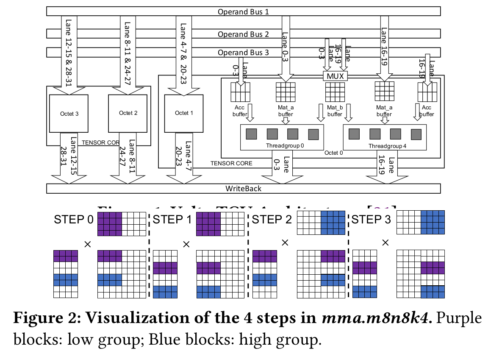
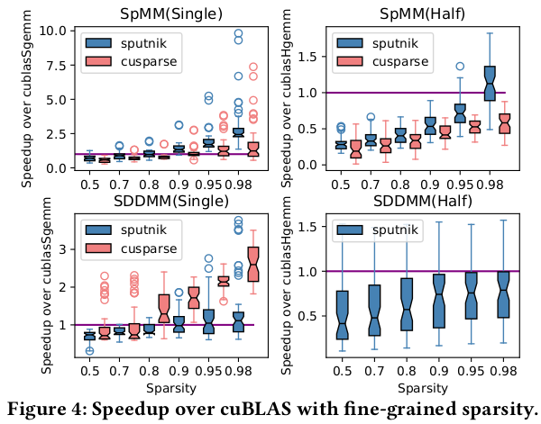
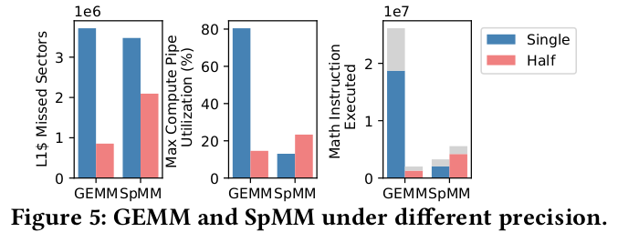

# Efficient Tensor Core-Based GPU Kernels for Structured Sparsity under Reduced Precision

Zhaodong Chen, Zheng Qu, Liu Liu, Yufei Ding, and Yuan Xie. 2021. Efficient tensor core-based GPU kernels for structured sparsity under reduced precision. In Proceedings of the International Conference for High Performance Computing, Networking, Storage and Analysis (SC '21). Association for Computing Machinery, New York, NY, USA, Article 78, 1–14. https://doi.org/10.1145/3458817.3476182

## What
SpMM and SDDMM with **column-vector-sparse-encoding** in **half precision**.

## Why
Less memory usage. Faster training/inference. Better data reuse.

## How
Column vector sparse encoding and Tensor-core based 1D-Tiling.

## Notes

* cuBLASHgemm -> Half precision GEMM. 
* They propose SpMM and SDDMM kernels and achieve 1.71-7.19x speedup over cuSPARSE.
* Achieves speed up over cuBLASHgemm under >70% and >90% sparsity with 4x1 grain size and half-precision.
* Existing implementations are insufficient for achieving practical speedup over their dense counterparts in half precision (FP16).
  * After using FP16, fast memory can cache more operands to improve data reuse, which is fully exploited by dense GEMM kernels. Whereas, fine-grained sparse kernels with much lower data reuse fail to exploit this benefit.
  * Although structured sparsity can be introduced to improve data reuse, existing libraries like cuSPARSE cannot deliver practical speedup with small sparsity granularity.
  * As you increase the sparsity granularity, it is harder to maintain accuracy.

### CUDA Terminology

* Consecutive 4 threads in a warp is called **thread group**. Thread group id: (threadIdx % 32) / 4.
* Thread group i (0,1,2,3) and thread group i+4 (16,17,18,19) together form **Octet** i. i is the low group and i+4 is the high group.
* LDG 128 can be used to increase the sectors per request to L1 Cache. 
* 128 means each thread reads 128 bits from the global memory (e.g. 8 operands under the half precision).
* A warp uses 2 TCUs at the same time. Each TCU is controlled by two octets.
* Each thread group in the octet has its own buffer for storing the LHS matrix (Mat_a buffer) and accumulation result (Acc buffer)
* Each thread can access a four-by-four inner product unit (gray blocks).
* The RHS matrix buffer (Mat_b buffer) is shared by the two thread groups within each Octet. Its source is selected by a multiplexer.

* Two levels of APIs for TCU:
  * Warp-level matrix multiply and accumulate (WMMA) performs dense MM with a warp. wmma.m8n32k16 computes (8x16).(16x32) GEMM with a warp.
  * Matrix multiply and accumulate in PTX performs 4 dense MM with a warp, one for each octet. mma.m8n8k4 computes four (8x4).(4x8) MMs.

* Another portion of performance speedup of HGEMM comes from the use of TCU. Figure 5 shows that the maximum compute pipeline
utilization of GEMM is reduced from 88.44% (FMA) to 14.6% (Tensor), which suggests that the compute bound is addressed by TCU.
* Multiple FMA instructions are fused into a single HMMA instruction, which removes 92.3% instructions.

* Blocked-ELL is nice but needs block size greater than 8. When you increase the block size too much, accuracy degradation starts. You gotta consider this trade off well.

* 5 Things to consider:
  * Reduce program size to avoid overflow the instruction cache.
  * Increase the grid size to hide the latency through thread-level parallelism
  * Reduce fixed latency operations through looping unrolling, computing offset and constants at compile time, as well as merging floating point operations to HMMA with TCU
  * Directly load data with few reuse opportunities to the register file without using the shared memory.
  * Improve bandwidth utilization with 128B coalesced transactions and long vector memory operations

* The number of data reuse is determined by m and TileN but not the number of columns (k in SpMM and n in SDDMM) in each block.
* This encoding is equivalent with replacing each nonzero scalar in the CSR sparse matrix with a nonzero column vector.

* The elements within each nonzero column vector are stored in consecutive addresses.
* The consecutive vectors in the same row are also consecutive in the memory space.

