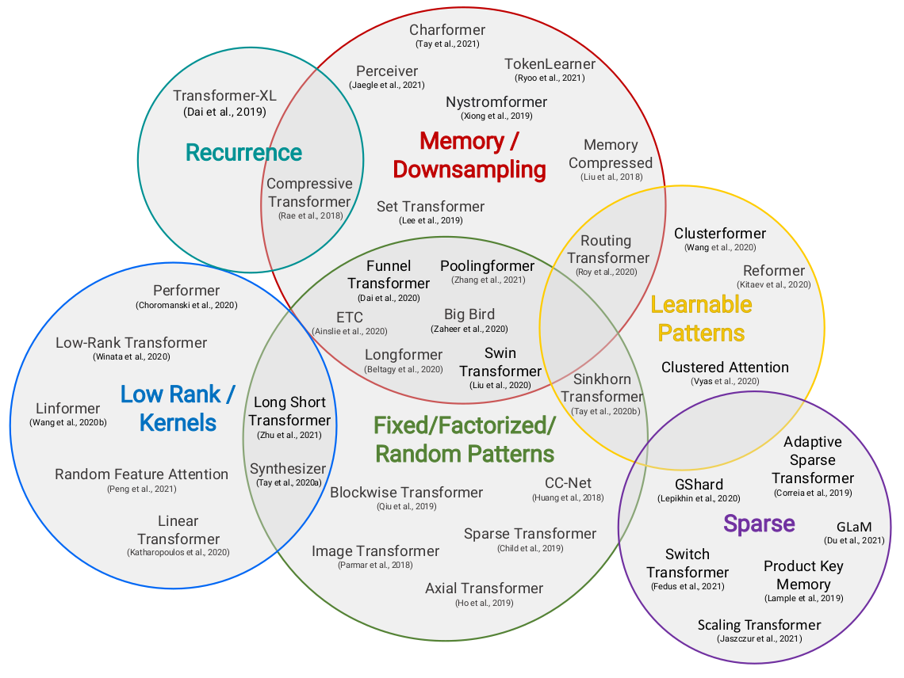

# Efficient Transformers: A Survey

Tay, Yi, et al. "Efficient transformers: A survey." ACM Computing Surveys (CSUR) (2020).

## Notes

* The input to the Transformer model is often a tensor of shape RB × RN , where B is the batch size, N the sequence length.
* Input after embedding layer: RB × RN × Rdmodel
* The compute costs of the self-attention mechanism contributes partially to the overall compute cost of the Transformer. 
* A non-trivial amount of compute still stems from the two layer feed-forward layers at every Transformer block (approximately half the compute time and/or FLOPs).
* Transformer modes:
  * (1) Encoder-only (e.g., for classification), 
  * (2) Decoder-only (e.g., for language modeling), and 
  * (3) encoder-decoder (e.g., for machine translation)

* In the encoder mode, there is no restriction or constraint that the self-attention mechanism has to be causal, i.e., dependent solely on the present and past tokens.
* In the encoder-decoder setting, self-attention used in the decoder (i.e. across decoding positions) must be causal since
each auto-regressive decoding step can only depend on previous tokens, whereas the self-
attention used in the encoder need not.

