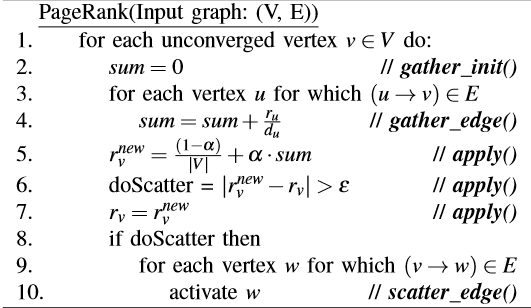
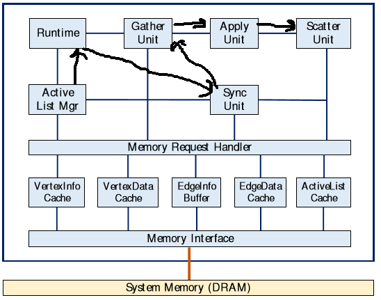

# Energy Efficient Architecture for Graph Analytics Accelerators

Reference: M. M. Ozdal et al., "Energy Efficient Architecture for Graph Analytics Accelerators," 2016 ACM/IEEE 43rd Annual International Symposium on Computer Architecture (ISCA), Seoul, 2016, pp. 166-177

## Learn more about the followings:
* Vertex-centric applications with irregular access patterns and asymmetric convergence.
* CPU vector extensions such as SSE and AVX.
* GraphLab (Done)
* SystemC
* Memory level parallelism
* Outstanding memory requests and MSHRs (Done)
* Access granularity (Done)

## Questions:
* What does graph-parallel computation mean? 

It is similar to data-parallel computation. In data-parallel computation, we process **independent data** on **seperate resources**. In grap-parallel computation, we partition the graph data (**dependent**) across processing resources and then resolve the dependencies through iterative computation. 

* What is vertex-centric abstraction model?
  
Vertex-centric means "think like a vertex".

* What is scale-free graph?

It is a graph type whose degree distribution follows a power law.

## Notes:

* Many existing works focus on accelerating compute-intensive tasks using **programmable hardware** (GPUs, CPU vector extensions such SSE and AVX) or custom hardware. Common characteristic of these applications: regularity and thread level parallelism. 
* It is not convenient to use existing platforms for applications with **irregular execution patterns**.
* This paper focuses on **iterative graph-parallel** applications with **asynchronous execution** and **asymmetric convergence** 
* This kind of applications can be represented with a **vertex-centric abstraction model**. 
* **GraphLab** is an abstraction model to make it easy for domain experts to develop parallel and distributed programs.
* Objective of the paper is to create an abstraction model similar to **GraphLab** but targeted for architecture and hardware development of graph analytics accelerators.
* Authors propose a customaziable architecture template that is specifically optimized for the target class of graph applications.
* The architects plug in application-level data structures and operations into the template and generate the hardware implementation.
* Instruction window size limitations.

### Contributions
* An architecture specifically optimized for vertex-centric, iterative, graph-parallel applications with irregular access patterns and asymmetric convergence.
* Cycle-accurate and synthesizable SystemC models that implement the proposed architecture template.
* An experimental study that compares the **area, power, and performance** of the generated hardware accelerators with CPU implementations.

### Characteristics of Irregular Graph Applications

#### Asymmetric Convergence
The number of iterations each vertex needs to be processed before convergence may vary significantly.

#### Async Execution
Async execution often converges much faster than synch execution but it may converge slower for some applications because of potential synchronization overheads (Race conditions).

#### Memory Access Bottlenecks
* A vertex/edge processed is unlikely to be processed again before most of the other vertices/edges are processed (poor temporal locality).

* For real life unstructured graphs, the data of neighboring vertices are unlikely to be in the same cache lines (poor spatial locality).

#### Load Imbalance
Small percent of vertices cover most of the edges. 

### Limitations of General Purpose CPUs
For graph applications:
* Memory latency is the main performance bottleneck.
* Low memory level parallelism (MLP) leads to under-utilization of the DRAM bandwidth.
* Overall performance scales linearly with memory bandwidth consumption because of overlapped access latencies.

Limitation of CPUs:
* For a single OOO core, maximum number of outstanding memory requests is bounded by the number of MSHRs which is 10 for IvyBridge core but for a DRAM with 90ns latency, 64GB/s bandwidth and 64B access granularity, we need at least 90 outstanding memory requests to fully utilize the DRAM bandwidth. Graph processing workloads sustain far less than 10 outstanding memory request **per core** due to instruction window size limitations.
* Using multiple cores can allow **better bandwidth utilization** but **reduces the energy efficiency** due to number of stalled cores. This happens because data locality is awful. So, caching principle does not work well for graph applications.
* For multi-core systems, synchronization overheads in the sync mode kills the performance. Async mode is sometimes even slower than sync mode.

### Limitations of Throughput Architectures
Three key features of throughput architectures (e.g. GPU):
1. Simple Cores
2. Extensive Multithreading
3. Single Instruction Multiple Data (SIMD)

GPUs hide long memory access latencies by scheduling thousands of threads. However, iterative graph algorithms require synchronization and atomic access to common data structures. Efficient global synchronization among thousands of threads is not supported in today's GPUs.

* Due to asymmetric convergence, the set of vertices can change significantly. Therefore, statically assigning vertices to GPU threads do not work well. 
* Async execution requires fine-grain synchronization netween neighboring vertices which is not well suited for GPU architectures due to expensive locking mechanism.
* GPUs achieve their peak memory bandwidth only when accesses are coalesced but it is not the case for grahps with irregular memory access patterns.

### Graph Parallel Abstraction
There are several frameworks to develop parallel and distributed software for graph-parallel apps. This paper focuses on vertex-centric abstraction model that consists of **Gather-Apply-Scatter** (GAS) functions.

**Gather**: Collect data from the neighboring vertices and edges. \
**Apply**: Perform computation. \
**Scatter**: Distribute vertex data to neighbors. Schedule the neighboring vertices for future execution if needed.

The exact programming interface for the architeture template was not included in this paper (Check whether they published another paper that includes this).

To implement PageRank in this template, user defines the data structure associated with a vertex as a pair of fixed-point values, corresponding to:

1. One over vertex degree (1/dv)
2. Vertex rank (rv)

Then, the user fills in the pre-defined functions corresponding to different GAS operations (just like in the PageRank algorithm above). For example, _gather_edge_ function consists of a simple multiply-add operation, while the _scatter_edge_ functinos sets a predicate parameter based on the result of apply. 

All these structures and functions are defined in C and plugged into the architecture template.

### Proposed Architecture
Single accelerator unit connected to the system DRAM.

Accelerator is loosely-coupled with host processor and it is connected to the system DRAM. Host processor populates the graph data in DRAM and sends a signal to the accelerators. Once the accelerator finishes computation, it sends a signal back to host.

* Tens of vertices and hundreds of edges are processed **simultaneously** to achieve high levels of MLP.
* Scale-free graphs are handled through dynamic load balancing.
* Synchronization between concurrently processed vertices and edges is done in the Sync Unit (SYU)
* The set of active vertices is maintained by the Active List Manager (ALM)
* The memory subsystem is optimized for sparse graph data structures.

**AL**: Active List. Containst set of active vertices.\
**RT**: Runtime. Controls how many vertices can be processed at a given time. \
**SYU**: Sync Unit. Responsible for sequential consistency between vertices that are being executed concurrently. \
**GU**: Gather Unit. Loads the data associated with each vertex. Iterates over all incoming edges of a vertex. Accumulates the data specified by the application. \
**APU**: Apply Unit. Does the computation. \
**SCU**: Scatter Unit. Schedules neighbors for future execution if necessary.

#### Execution Flow
ALM extracts vertices from AL and sends them to RT. If there are enough resources, RT starts the execution of a vertex by sending it to the SYU. SYU assigns a rank to each vertex, and sends it to the GU. GU loads the data associated with each vertex. Then, iterates over all incoming edges of a vertex and accumulates the data specified by the application. GU sends the data to APU. APU does the computation. APU sends computed data to SCU. SCU distributes it to the neighbors and schedules neighbors for future execution if necessary.

#### A. Gather Unit (GU)
* Implements gather program **for each vertex v**. 
* Latency tolerant. Many vertices and edges are processed concurrently. Partial states are stored locally.
* Limited storage of GU is shared among all concurrently processing vertices.
* Uses a credit based mechanism.