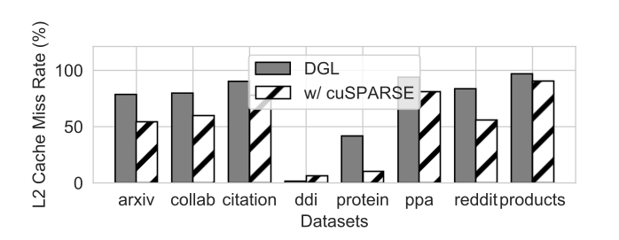
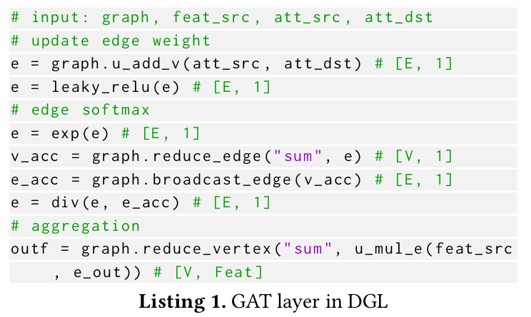
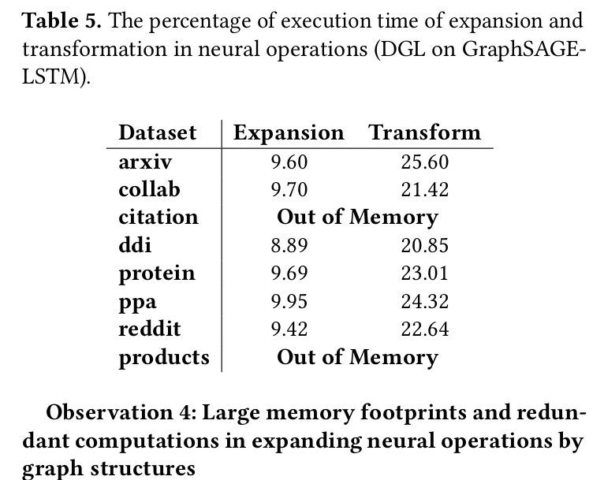

# GNN-Performance-Optimization

## Observations

**1. Poor locality in graph operations due to edge granularity.**

An edge indicates data transfer. Let E be the number of edges in the graph and feature_length the length of the node feature vector. The graph operations on one layer could involve E * feature_length bytes of data movement in loading node features. The total size of the node features is however only N \* feature_length where N is the number of nodes. In an ideal case N * feature_length needs to be loaded. 

* PyG uses edge-wise parallelization for a graph structure with **edge list format**. First step is to expand the feature matrix of [N, feature_length] to the source feature matrix of [E, feature_length] which duplicates the features of source nodes in the edge list. Then, it performs reduction on the source feature matrix. Two steps are performed in seperate kernels.

* DGL uses **CSR format**.DGL avoids the large space usage by using node-wise parallelization with **center-neighbor pattern**. Each task does computation for a center node and its neighbor nodes. Each task first fetches data from the feature matrix and then performs reduction to update the feature of the center node. If the reduce function is SUM, it uses cuSPARSE. Else it performs these to steps in a single kernel.

**2. Severe workload imbalance**

DGL distributes tasks in center node granularity, assigning the computations for a center node and all its neighbors to one computing unit which causes workload imbalance. Since PyG is using edge list, imbalance is not a big problem.

**3. Redundancy in memory access and large overhead due to intensive function calls**

There are hence repeated loading of the graph structures (for DGL) or redundant global memory accesses (for PyG), which causes large overhead.

**4. Large memory footprints and redundant computations in expanding neural operations by graph structures**

Neural operations performed in center-neighbor pattern are based on the graph structure. DGL, for instance, breaks the computation into two steps; it frst expands each center node’s neighbor feature into a continuous memory space, and then performs the neural operations on the expanded matrix in a dense way. First step (expansion) causes large memory footprint, second step (transformation) causes large redundancy.

**5. Inefficiency on variant feature lengths**

PyG's and DGL's task distribution and the mapping of computation to threads remain the same for different feature lengths. As the performance of graph operations are very sensitive to locality, utilizing the same schedule for different feature lengths can lead to large performance gaps.