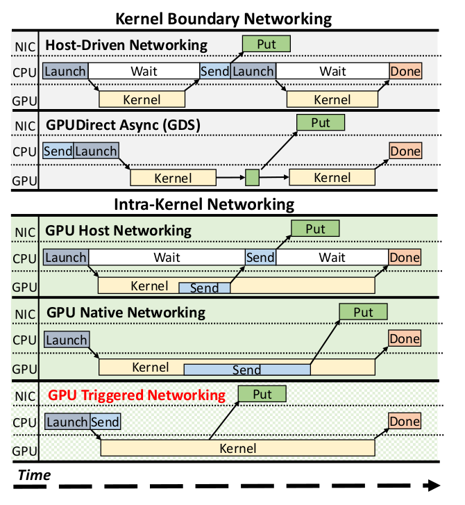
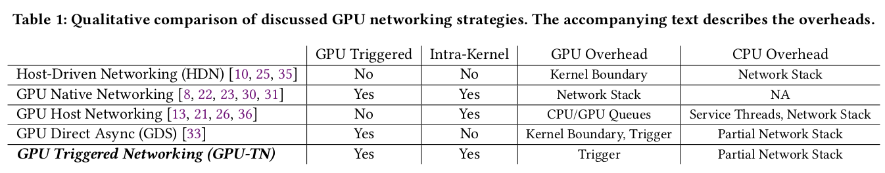
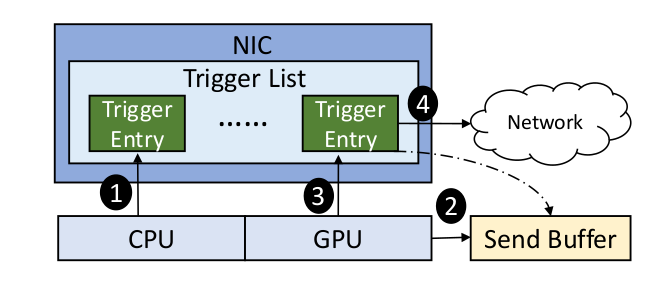

## Notes

* Figures are pretty explanatory.

## GPU-TN advantages

* **GPU Triggered**: GPU initiates network transfers by communicating directly with the network adaptor (it rings the doorbell on NIC)

* **Intra-kernel Initiation**: Doesn't have to make the transfers on boundaries.

* **Reduce GPU Overhead**: CPU constructs the network packet and registers it to the NIC (No need for network stack on GPU).

* **Reduce CPU Overhead**: Does not require helper threads like GPU Host Networking. 

* **Relaxed Synchronization**: The GPU can initiate messages that have not yet been posted by the CPU, providing hardware-level synchronization to associate the two operations on the NIC.

