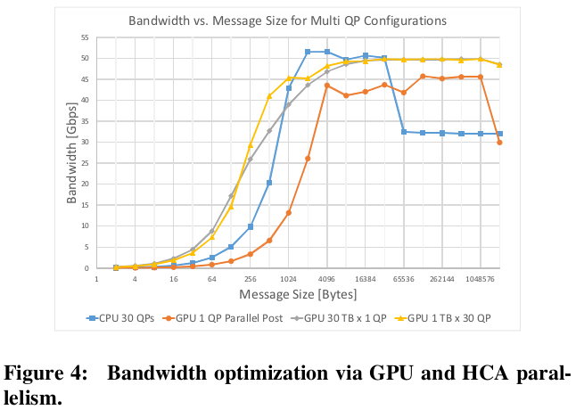

# GPUrdma: GPU-side library for high performance networking from GPU kernels

Feras Daoud, Amir Watad, and Mark Silberstein. 2016. GPUrdma: GPU-side library for high performance networking from GPU kernels. In Proceedings of the 6th International Workshop on Runtime and Operating Systems for Supercomputers (ROSS '16). Association for Computing Machinery, New York, NY, USA, Article 6, 1–8. DOI:https://doi.org/10.1145/2931088.2931091

## Notes

* RDMA across the network directly from GPU kernels.
* In other inter-GPU communication approaches, data transfer calls must be invoked by the CPU, while ensuring that the GPU kernel that generates the data terminates before the transfer starts. This approach has the following constraints: 
  * Applications are forced to be split into bulk-synchronous phases. Multiple buffers are required to implement double buffering, and computations must be broken down to work on small tiles that fit into smaller buffers.
  * Synchronizing between kernel execution and network operations is complicated since GPUs and NICs expose different synchronization mechanism. 
  * Kernel invocation is costly for short kernels.
  * The messages to be transferred to other machines must be accumulated in internal GPU buffers during the kernel execution which constraints the amount of data a kernel may process at once.
* They use persistent kernels.
* Increases the register pressure.
* Uses [GPI library](https://github.com/cc-hpc-itwm/GPI-2) as a baseline.



Example implementation:

```C++
__device__ stencil(float* area) {
    gpu_gaspi_notify_waitsome(...);
    area[threadIdx.x] = 0.5 * (area[threadIdx.x - 1] + area[threadIdx.x + 1])

    __syncthreads();

    gpu_gaspi_write_notify(...);
}
```