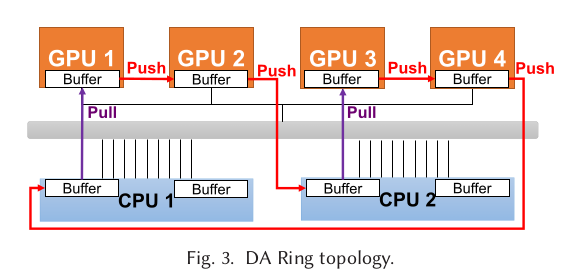
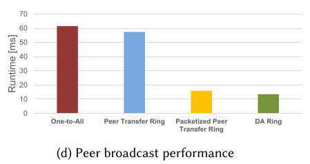
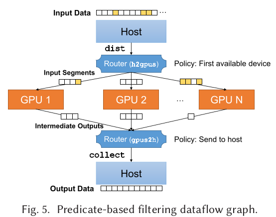
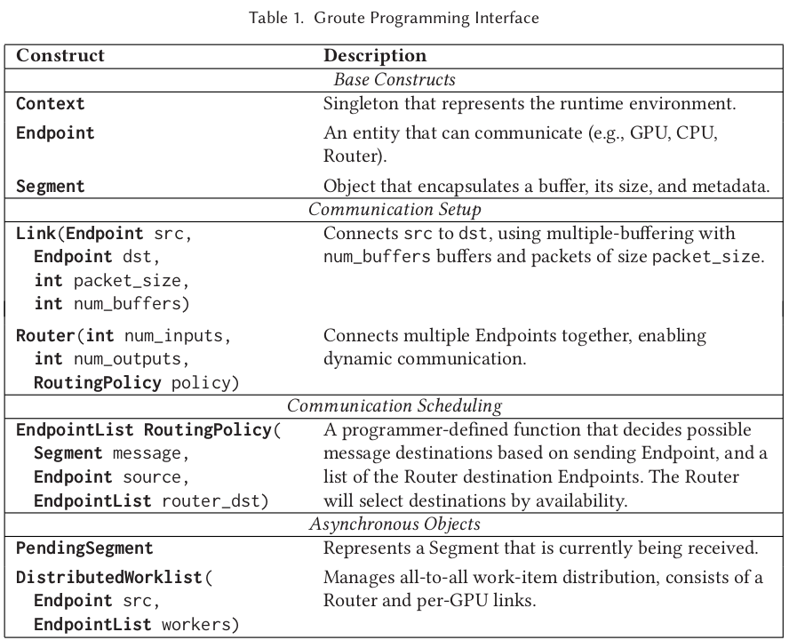
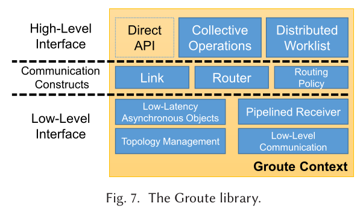

# Groute

https://github.com/groute/groute

## Learn More About This Stuff

* Push-pull implementation.
* Stream synchronization with events

## Notes

* They call host-initiated memory transfers "**Peer Transfer**" and device-initiated memory transfers "**Direct Access**" (DA).
* DA performance is highly sensitive to memory alignment, coalescing, number of active threads, and order of access.
* In indirect copy, the source GPU “pushes” information to host memory first, after which it is “pulled” by the destination GPU using host flags and system-wide memory fences for synchronization.
* The link/router model does not define a global address space or remote memory access operations, but functions as a message-passing distributed memory environment.
* Does not take topology into account.
* Interesting stuff: pipelined receiver, double-tripple buffering, distributed worklist, event-pools, event-futures
* Apps implemented: BFS, SSSP, PR, CC




## Programming Model
Two phases:

* Dataflow Graph Construction
* Asynchronous Computation

### Dataflow Graph Creation
DAG with endpoints. An endpoint could be:

* Physical device (CPU, GPU etc)
* Virtual device (router)

There are links between endpoints.



Routers have policies.


### Predicate-Based Filtering Implementation

```C++
vector<T> input = ...;
vector<T> output;
int packet_size = ...;

Context ctx;
auto all_gpus = ctx.devices();
int num_gpus  = all_gpus.size();

Router h2gpus(1, num_gpus, AnyDevicePolicy); // Scatters input array
Router gpus2h(num_gpus, 1, AnyDevicePolicy); // Gathers input array 

Link dist(HOST, h2gpus, packet_size, 1);
Link collect(gpus2h, HOST, packet_size, 2); // Double buffering

for (device_t dev : all_gpus) {
    std::thread t(WorkerThread, 
                  Link(h2gpus, dev, packet_size, 2), 
                  Link(dev, h2gpus, packet_size, 2));
    t.detach();
}

dist.Send(input, input_size); // Scattering command
dist.Shutdown();

while(true) {
    PendingSegment out_seg = collect.Receive().get();
    if(out_seg.Empty()) break;
    out_seg.Synchronize();
    append(output, out_seg);
    collect.Release(out_seg);
}

EndPointList AnyDevicePolicy(Segment& message, EndPoint src, EndPointList& router_dst) {
    return router_dst; // Select first available device
}

void WorkerThread(device_t dev, Link in, Link out) {
    Stream stream(dev);
    T *s_out = ...;
    int *out_size = ...;

    while(true) {
        PendingSegment seg = in.Receive().get(); // asynchronously handle each incoming message
        if(seg.Empty()) break; // terminate when shutdown signal received
        seg.Synchronize(stream); // Synch with stream
        Filter<<<kernel_params>>>(seg.Ptr(), seg.Size(), s_out, out_size);
        in.Release(seg, stream); // release incoming buffer
        out.Send(s_out, out_size, stream); // transmit result to host
    }
    out.Shutdown(); // shutdown signal to gpus2h
}
```

The above code gives a good overall view of the implementation. Dig into https://github.com/groute/groute for implementation details.

TODO: Check distributed worklist implementation.



### Distributed Worklist

* Maintains a list of computations (work-items). Each computation can create new computations that are queued to the same list.
* Global coordination and work counting is centralized and managed by
the host.
* During runtime, devices periodically (check how often this happens) report produced and consumed work-items for tracking purposes. Once the number of total work-items becomes zero, processing stops and a shutdown signal is sent to all participating devices via router links.
* The worklist is implemented over a single, system-wide router.
* Each device contains a locally managed worklist, which comprises one or more multiple-producer-single-consumer queues for local tasks. 
* Two threads per device: worker thread and receiver thread for communication and work-item circulation.
* Each device receives info from previous device. 
* Received info is filtered, relevant info is pushed onto the local worklist, irrelevant info is sent to the next device.
* At the same time, the worker thread processes existing work-items, separating the resulting items to local and remote work (SplitSend) and packing outgoing information as necessary.
* To implement a algo with Groute, the programmer needs to give five functions: Pack, Unpack, OnSend, OnReceive, and GetPrio. 