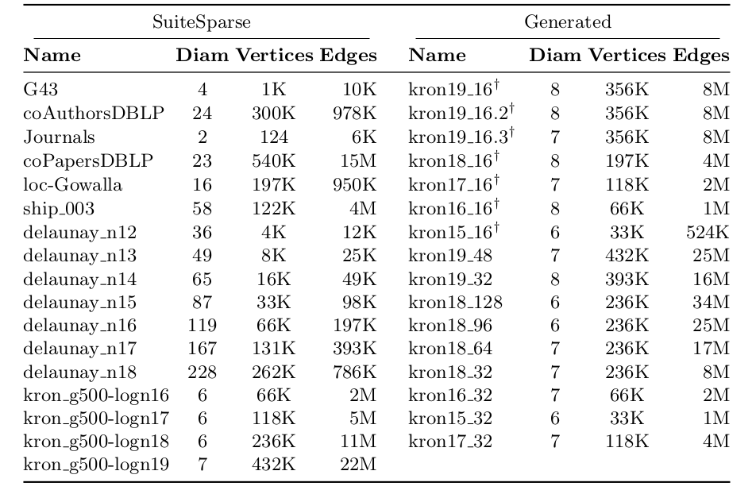
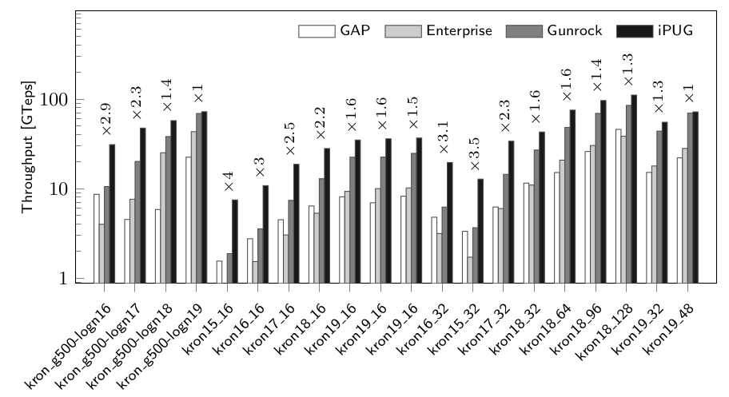

# iPUG: Accelerating Breadth-First Graph Traversals using Manycore Graphcore IPUs

Luk Burchard[0000−0002−8019−7047],Johannes Moe[0000−0001−7664−9517], Daniel Thilo Schroeder[0000−0003−0125−5243], Konstantin Pogorelov[0000−0002−7993−1769]
, and Johannes Langguth [0000−0003−4200−511X]

## Notes

* The device was designed for AI workloads (so, no special support for irregular data structures such as graphs).
* All communication between cores must be declared at compile time (not cool).
* They use Colossus GC2 IPU. There is a new IPU coming (M2000 IPU). So, that new IPU's performance could be even better.
* 45TB/s aggregate bandwidth, 6 clock latency (~3.75ns). For NVIDIA V100, latency for L1 is ~28 cycles (~18ns), shared memory is ~19 cycles (~11ns). 
* Each tile has 256KB local memory, 304MB in total. In V100, each SM has 256KB local memory as well but ~20MB in total. 
* Most applications in scientific computing and machine learning exhibit sparse matrix dense vector (SpMV) communication, which means that the same communication pattern repeats over multiple rounds. On the other hand, graph algorithms such as BFS exhibit sparse matrix sparse vector (SpMSpV) communication where only some of the vertices or matrix rows/columns are active in each round, thus creating a new communication pattern each time.

