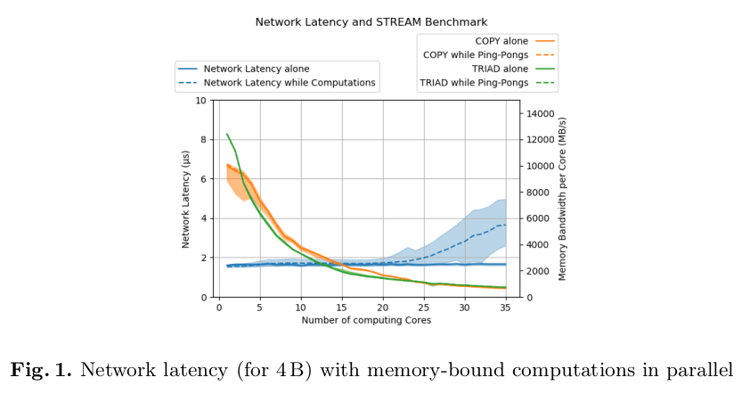
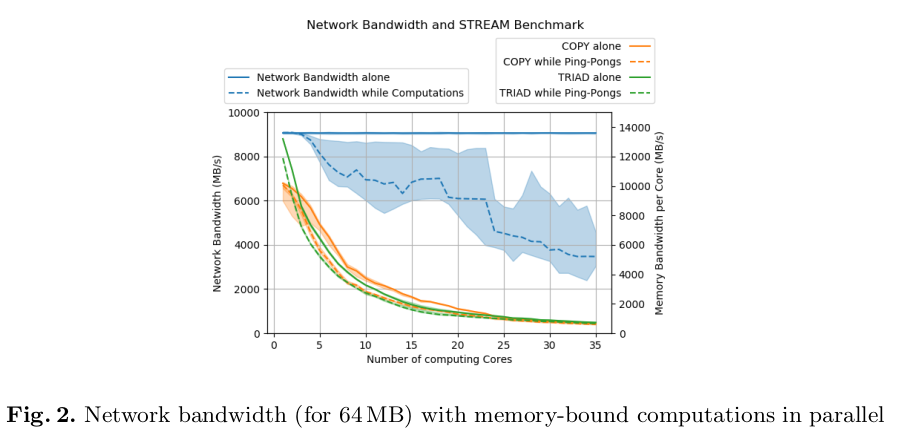

# Interferences between Communications and Computations in Distributed HPC Systems

Philippe Swartvagher. Interferences between Communications and Computations in Distributed HPC Systems. Euro-Par - 27th International European Conference on Parallel and Distributed Computing, Aug 2021, Lisbon / Virtual, Portugal. Euro-Par 2021: Parallel Processing Workshops.

## Notes

* They want to see the affect of running communication and computation together.
* Their benchmark contains three settings:
  * Communication without computation
  * Computation without communication
  * Communication with computation

Computations and communications **use different data** and hence are completely independent.

Two metrics to measure communication performance:

* Latency by exchanging 4 bytes of data (why 4?)
* Bandwidth evaluated for 64MB message size (why 64MB?)

Computations are emberassingly parallel.

They generate memory contention by computing cores doing memory-bound kernels (COPY or TRIAD)

