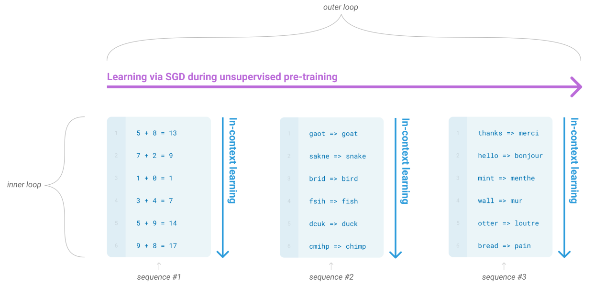
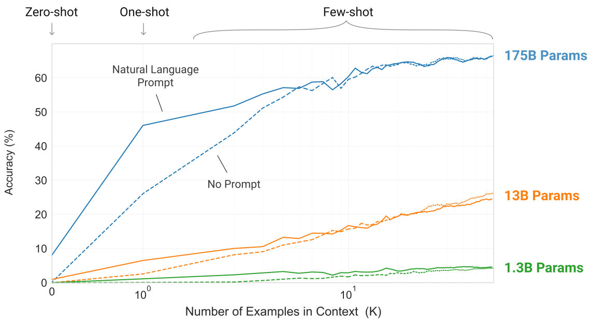
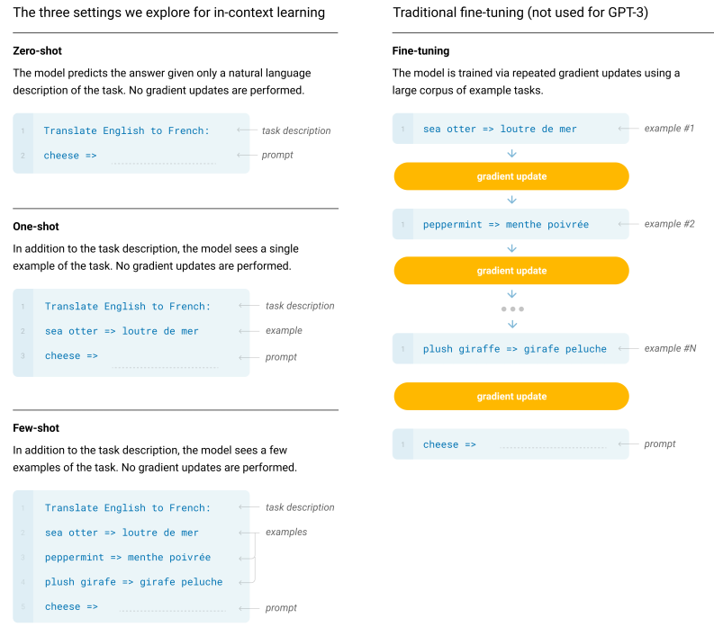
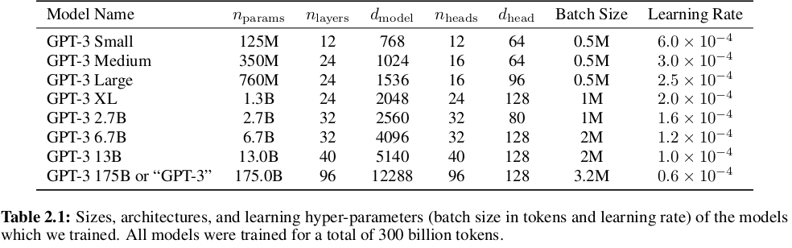

# Language Models are Few-Shot Learners

Brown, Tom, et al. "Language models are few-shot learners." Advances in neural information processing systems 33 (2020): 1877-1901.

## What

They train a task-agnostic 175 billion params model (GPT-3) that shows SOTA performance for certain tasks.

## Why

* Because task specific fine-tuning requires a new dataset for each task. 
* Humans do not require large supervised datasets to learn most language tasks – a brief directive in natural language (e.g. “please tell me if this sentence describes something happy or something sad”) or at most a tiny number of demonstrations (e.g. “here are two examples of people acting brave; please give a third example of bravery”) is often enough.

## How

They scale up the model to increase task agnostic performance in a few-shot setting.

## Notes

* Conventional way: Pretrain + Finetune
* Humans can generally perform a new language task from only a few examples or from simple instructions – something which current NLP systems still largely struggle to do.
* They show that scaling up language models greatly improves task-agnostic, few-shot performance, sometimes even reaching competitiveness with prior state-of-the-art fine-tuning approaches

* They evaluate for three conditions:
  * **Few-shot Learning**: They allow as many demonstrations as will fit into the model’s context window (typically 10 to 100). 
  * **One-shot Learning**: They allow only one demonstration.
  * **Zero-shot Learning**: No demonstrations. Only an instruction in natural language is given to the model.

* They use same model architecture with GPT-2. The only difference is that they use alternating dense and locally banded sparse
attention patterns in the layers of the transformer, similar to the Sparse Transformer.

* Larger models can typically use a larger batch size, but require a smaller learning rate