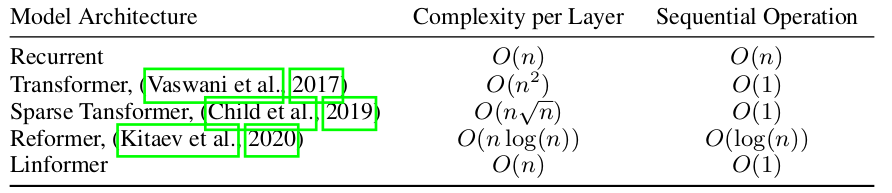

# Linformer: Self-Attention with Linear Complexity

## What

O(n) attention.

## Why

Attention is O(n^2) in both time and memory.

## How

By decomposing the original scaled dot-product attention into multiple smaller attentions through linear projections, such that the combination of these operations forms a low-rank factorization of the original attention.

## Notes

* Pretrained using masked language modeling objective.
* Fine-tuned on three tasks from GLUE and one sentiment analysis task.