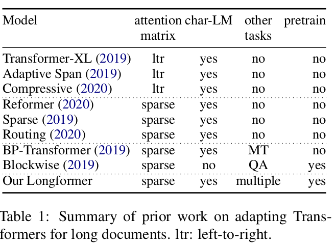
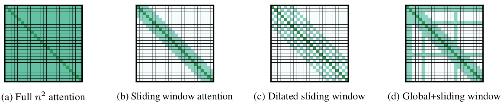

# Longformer: The Long-Document Transformer

Beltagy, Iz, Matthew E. Peters, and Arman Cohan. "Longformer: The long-document transformer." arXiv preprint arXiv:2004.05150 (2020).

## What

They introduce a new attention mechanism with local window attention (possibly dilated) and global attention. 

## Why

Cannot process long documents since attention complexity is O(n^2). 

## How

Local window attention + global attention.

## Notes

* They evaluate on character-level language modeling and achieve state-of-the-art results on **text8** and **enwik8**.

* Given a fixed window **w**, each token attends to 1/2**w** tokens on each side. O(n * w)

* Settings with different dilation configurations per head improves performance by allowing some heads
without dilation to focus on local context, while
others with dilation focus on longer context.

* Global attention attends to all tokens across the sequence, and all tokens in the sequence attend to it.

* For autoregressive language modelling, they use differing window sizes across the layers