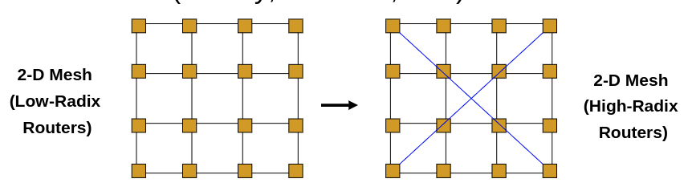

# Merrimac: Supercomputing with Streams

W. J. Dally et al., "Merrimac: Supercomputing with Streams," SC '03: Proceedings of the 2003 ACM/IEEE Conference on Supercomputing, 2003, pp. 35-35, doi: 10.1145/1048935.1050187.

## What

We need to increase the arithmetic intensity (# of arithmetic operations / # of memory access)

## Why

Arithmetic units are cheap and bandwidth is expensive. 

## How

By using streams. Memory bandwidth is reduced by capturing short-term producer-consumer locality in large local register files, and long-term producer-consumer locality in a stream register file.

Exploits the application locality using a bandwidth hierarchy and application parallelism by using large numbers of ALUs.

## Notes

* Remember that this paper was released in 2003. At the time, there was no CUDA. The latest NVIDIA GPU was NV30. 
* I guess the stream register file that they are talking about is similar to shared memory in modern GPUs.
* Uses a high radix interconnection network.

* The cost of bandwidth grows at least linearly with distance in terms of both availability and power.
* SRF accesses are cheaper compared to cache access because it is aligned and  does not require tag lookup. Maybe that's why shared memory latency is much lower than L1 cache latency in modern GPUs. 

## Some Terminology

LRF = Local Register File
SRF = Stream Register File