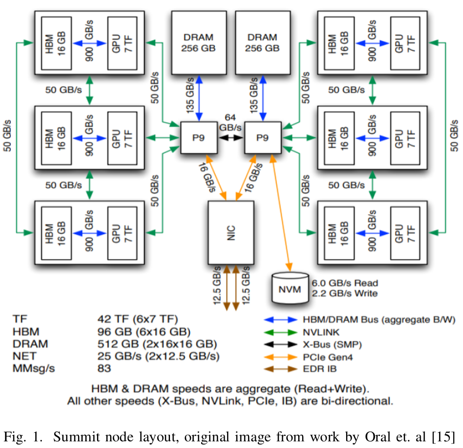
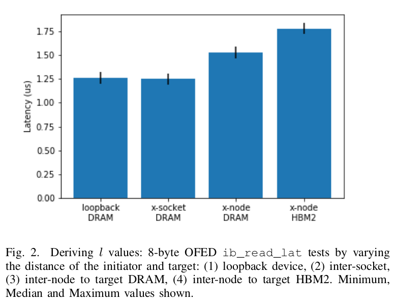
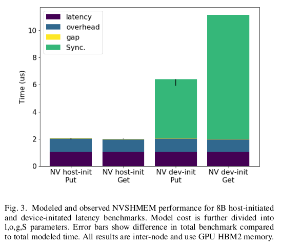

# Performance Trade-offs in GPU Communication A Study of Host and Device-initiated Approaches

Groves, Taylor, et al. Performance Trade-offs in GPU Communication: A Study of Host and Device-initiated Approaches. IEEE, 2020.

## What 
Examines device initiated and host initiated internode GPU communication with NVSHMEM.

## Why
Because efficient network communication on GPU-based systems is important. We need a way to reduce the communication overhead.

## How
They extend LogP communication model. They validate their model with distributed gemm benchmark. 

## Notes

* GPU-initiated communication is implemented using progress threads on the CPU each of which has a message queue associated with it. When a GPU
thread wishes to issue a communication operation, it will insert the metadata associated with the operation into the CPU queue. When the associated CPU progress thread dequeues the operation, it will prepare an Infiniband request and send it to the NIC. At this point, the NIC will directly copy the data
over the network to the remote GPU.

* LogGOP model: 
  - **L** = Latency. An upper bound on the latency, or delay, incurred in communicating a message containing a word from its source module to its target module. This parameter is significant for small messages.
  - **o** = Overhead. The length of time that a processor is engaged in the transmission or reception of each message; during this time, the processor
cannot perform other operations. This parameter is significant for small messages.
  - **g** = Gap. The minimum time interval between consecutive message transmissions or consecutive message receptions at a processor. The reciprocal of g corresponds to the available per-processor communication bandwidth. This parameter is significant for small messages.
  - **G** = Gap. The minimum time interval between consecutive message transmissions or consecutive message receptions at a processor **with respect to a message of size m bytes**. This parameter is significant for large messages.
  - **O** = Overhead. The length of time that a processor is engaged in the transmission or reception of each message; **with respect to an m byte message**.
  - **P** = The number of processor/memory modules.
  - **S** = The time spent in synchronization and consistency operations for necessary transfers between GPU cache to HBM2 and host DRAM. This parameters is **a fixed cost irrespective of message size**.
* Obstacles to measure the parameters:
  - Absent accurate fine-grained synchronization across clocks, latency must be derived from round-trip times.
  - Overhead for receiving (Or) is not always equal to the overhead of sending (Os).
  - Sophisticated NICs may act as another processor allowing for overlap with CPU overheads.
  - Protocol changes at various message sizes (e.g. MPI eager/rendezvous) change the overhead cost.
  - Gap and Overhead may overlap.
  - Pipelining may increase round-trip time while increasing throughput.
  - Caching may decrease the observed latency.
  - Scheduling of shared resources on CPUs and GPUs can be a source of variability.

* Two benchmarks to derive LogP parameters: OFED, and NVSHMEM Perftests.

* The GPU-initiated communication operations over Infiniband are implemented with the help of progress threads running on the CPU. When a GPU thread issues a
communication operation, it must also first issue a global memory fence to flush all modified state from the L2 cache to GPU global HBM2 memory. Only after it finishes this global memory fence can it perform an enqueue operation (consisting of one atomic fetch-and-add and four global GPU memory writes) to the queue associated with its CPU proxy thread. Once this write has been completed, the CPU progress thread can dequeue the metadata written by the GPU thread
and prepare and send the corresponding Infiniband request to the NIC.

* In order to ensure completion of communication operations, we can use the nvshmem_quiet() operation. In this function, the calling GPU threads poll a completion counter which is updated by CPU progress thread once the Completion Queue Entry (an IBV data structure) is generated. Finally, a system level memory fence must be issued to ensure all updated data is visible to all threads across the GPU as well as any clients interacting with the GPU using PCIe or NVLink.