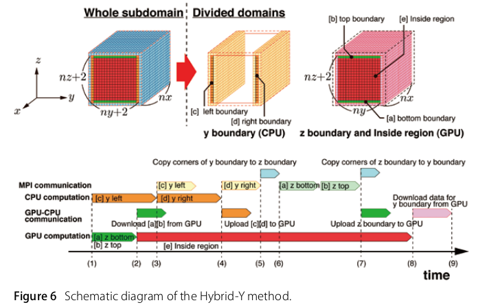
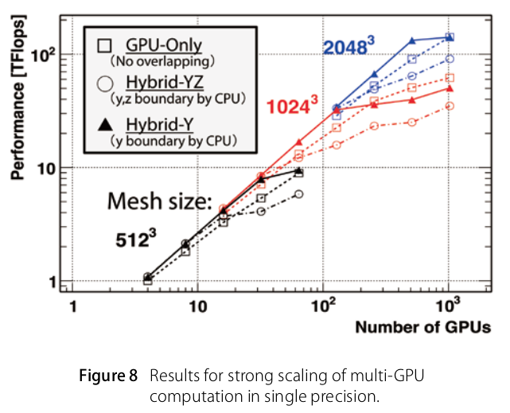
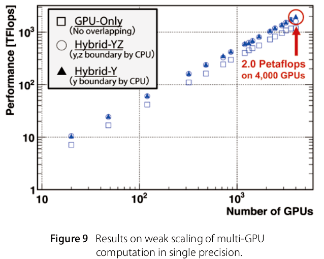

# Peta-scale Phase-Field Simulation for Dendritic Solidification on the TSUBAME 2.0 Supercomputer

Takashi Shimokawabe, Takayuki Aoki, Tomohiro Takaki, Toshio Endo, Akinori Yamanaka, Naoya Maruyama, Akira Nukada, and Satoshi Matsuoka. 2011. Peta-scale phase-field simulation for dendritic solidification on the TSUBAME 2.0 supercomputer. In Proceedings of 2011 International Conference for High Performance Computing, Networking, Storage and Analysis (SC '11). Association for Computing Machinery, New York, NY, USA, Article 3, 1–11. DOI:https://doi.org/10.1145/2063384.2063388

## What

GPU implementation of phase-field model.

## Why

Determining material properties (such as strength) requires millimeter-scale simulation. This was impossible with the supercomputers at that time.

## How

They discretize the phase-field equation using the finite difference method and develop a simulation code with CUDA.

## Notes

* A metal's strength depends on the solidification process.
* They implement three methods: GPU-only, Hybrid-YZ, Hybrid Y.
  - **GPU-only**: Compute all subdomains without any optimization.
  - **Hybrid-YZ**: Overlaps communication for the boundary data exchange with computation of the inside region, by dividing each subdomain into five regions, which are two y-boundaries, two z-boundaries and an inside region. CPU cores compute four Y and Z regions, GPU computes inside region. Bottleneck is CPU computation.
  - **Hybrid-Y**: Reduces CPU load. Assigns only y-boundary to the CPU.

  
  
  