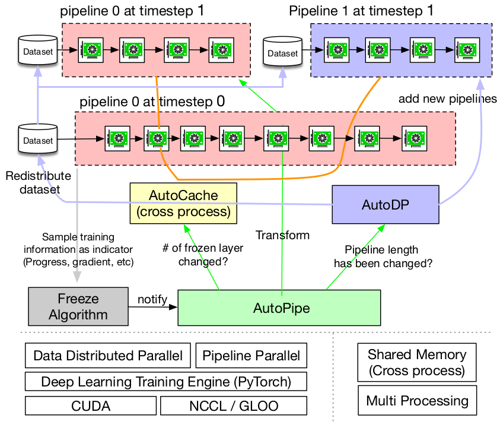
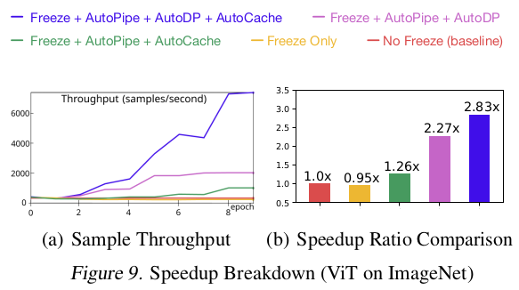
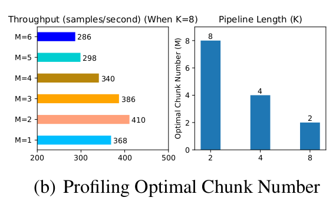

# PipeTransformer: Automated Elastic Pipelining for Distributed Training of Large-scale Models

He, Chaoyang, et al. "Pipetransformer: Automated elastic pipelining for distributed training of transformers." arXiv preprint arXiv:2102.03161 (2021).

## What

Elastic pipelining system that can dynamically allocate resources.

## Why

Bottom layers converge faster than top layers. No need to keep training them. When you exclude the bottom layers, you gotta load balance for performance.

## How

They exclude freezed layers from the model, then rebalance the pipeline (increase the dp width if necessary).

## Notes

* If we exclude some layers, we can pack rest of the layers into smaller number of GPUs.
* If we can pack them into smaller number of GPUs, we can increase the DP width (more pipeline replicas).
* The factors that affect the efficiency of pipeline partitioning: 
  * Partition granularity
  * Cross-partition activation size
  * Chunking (the number of micro-batches) in mini-batches.
* They evaluate with: 
  * VIT on ImageNet
  * BERT on GLUE and SQUAD.
* They maintain a customized version of PyTorch GPipe.

* Maintaining optimally balanced partitions does not guarantee the fastest training speed. There are other considerations such as:
  * **Cross-partition communication overhead**: Placing a partition boundary in the middle of a skip connection leads to additional communications since tensors in the skip connection must now be copied to a different GPU.
  * **Frozen layer memory footprint**
* It is sub-optimal to maintain a static number of microbatches.
* Since DDP must wait for the last micro-batch to finish its backward computation on a parameter before launching its gradient synchronization, **finer micro-batches lead to a smaller overlap between computation and communication**.
* Challenges:
  * **DDP Communication**: Collective communications in PyTorch DDP requires static membership, which prevents new pipelines from connecting with existing ones.
  * **State Synchronization**: Newly activated processes must be consistent with existing pipelines in the training progress (e.g., epoch number and learning rate), weights and optimizer states, the boundary of frozen layers, and pipeline GPU range.
  * **Dataset Redistribution**: The dataset should be re-balanced to match a dynamic number of pipelines.

* Solutions: 
  * Double communication process groups for DDP.
  * To redistribute the dataset, they implement a variant of DistributedSampler that can adjust data samples to match the number of active pipeline replicas.

