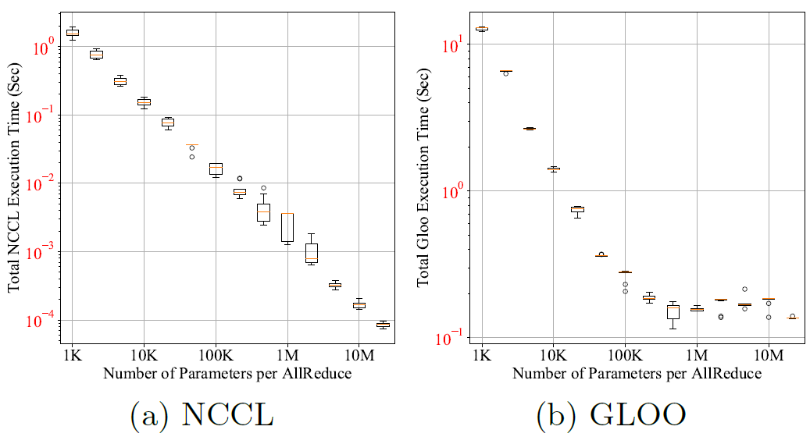
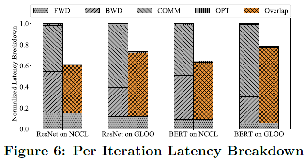
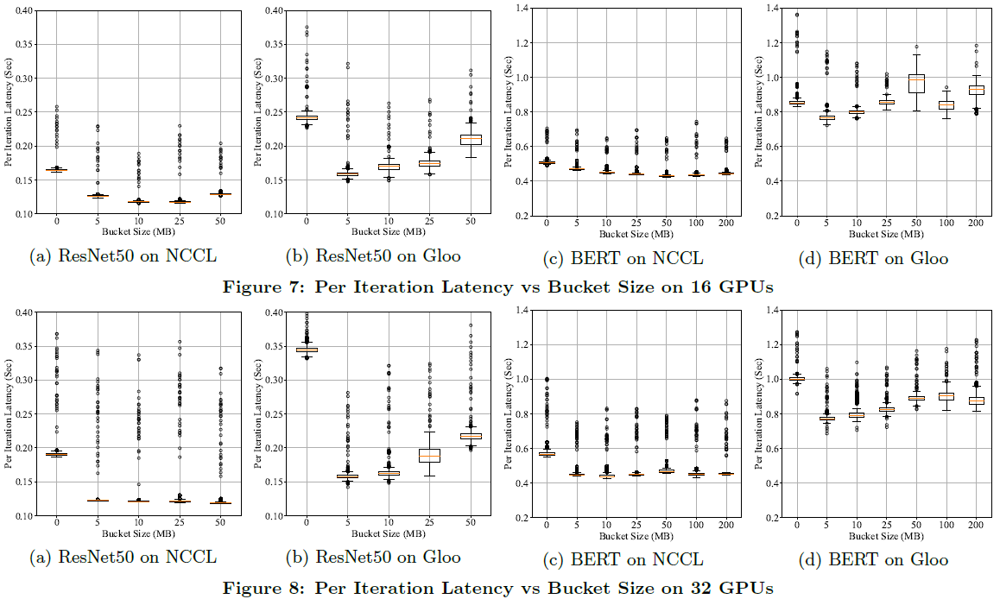

# PyTorch Distributed Experiences on Accelerating Data Parallel Training

Li, Shen, et al. "Pytorch distributed: Experiences on accelerating data parallel training." arXiv preprint arXiv:2006.15704 (2020).

## What

Design, implementation, and evaluation of the PyTorch distributed data parallel module.

## Notes

* Communication is the dominant training latency contributor, and its impact increases as model size increases. 
* Bucket sizes considerably affect communication effiency, which could lead to more than 2X speedup if confugured properly.
* Skipping synchronizations appropriately would significantly reduce amortized communication overhead without noticeably degrading convergence speed.
* They synch gradients instead of parameters.
* In terms of correctness, distributed data parallel training and local training must be mathematically equivalent.
* Collective communication performs poorly on small tensors, which will be especially prominent on large models with massive numbers of small parameters.
* Separating gradient computation and synchronization forfeits the opportunity to overlap computation with communication due to the hard boundary in between.
* **Gradient bucketing**: Instead of launching a dedicated AllReduce immediately when each gradient tensor becomes available, wait for a short period of time and bucket multiple gradients into one AllReduce operation. However, it should not communicate all gradients in one single AllReduce, otherwise, no communication can start before the computation is over.

* The AllReduce operation on gradients can start before the local backward pass finishes. With bucketing, DDP only needs to wait for all contents in the same bucket before launching communications.
* DDP registers one autograd hook for each gradient accumulator. The hook fires after its corresponding accumulator updating the gradients, and will inspect the bucket it pertains. If hooks of all gradients in the same buckets have fired, the last hook will trigger an asynchronous AllReduce on that bucket.
* There are knobs in the Python frontend (e.g. you can change the bucket size with bucket_cap_mb).
* On one hand, packing more gradients into the same bucket would reduce the amortized system overhead of communication. On the other hand, using a large bucket size would result in longer wait time for reduction, as each bucket needs to wait for more gradients. By default, each bucket is 25MB. Applications should measure their impact empirically and set it to the optimal value for their use cases.

