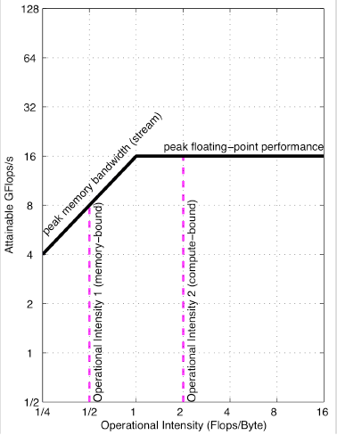

## Notes

* A model to provide bound and bottleneck analysis.
* **Operational Intensity** = Operations per byte of DRAM traffic
* Total bytes accessed = Bytes that go to main memory **after** they have been filtered by caches (measures traffic between the caches and the memory instead of processor and caches).
* Operational intensity suggests the DRAM bandwidth needed by a kernel on a particular computer. 
* The proposed model ties together **floating-point performance**, **operational intensity**, and **memory performance** together in a two dimensional graph.
* **Peak floating-point performance** can be found using the hardware specifications or microbenchmarks.
* **Peak memory performance** is defined by the memory system behind the caches. You can find it with STREAM benchmark.

