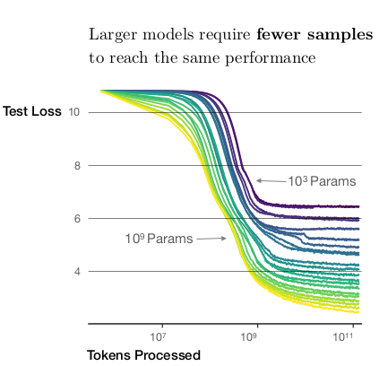
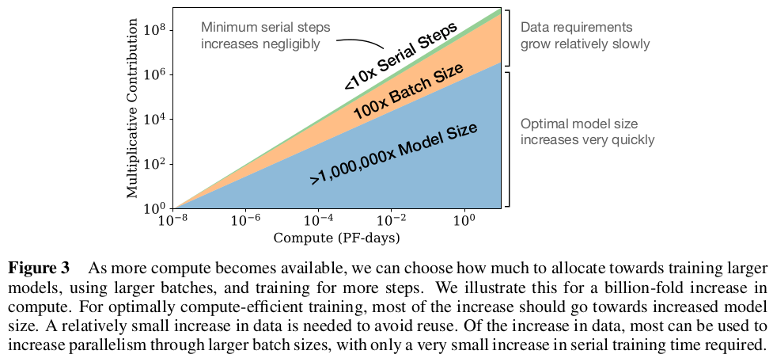
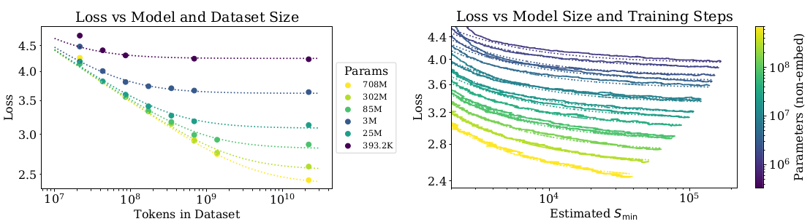
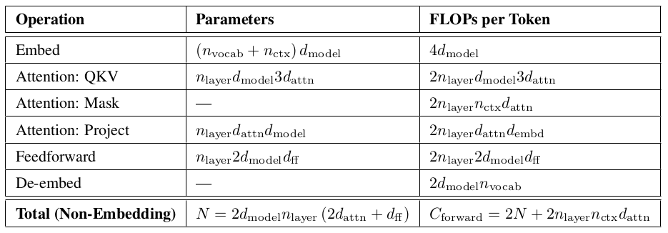

# Scaling Laws for Neural Language Models

Kaplan, Jared, et al. "Scaling laws for neural language models." arXiv preprint arXiv:2001.08361 (2020).

## Notes

* Model performance depends most strongly on scale, which consists of three factors: **the number of model parameters** N (excluding embeddings), **the size of the dataset** D, and **the amount of compute** C used for training.
* The performance penalty depends predictably on the ratio (N ^ 0.74) / D, meaning that every time we increase the model size 8x, we only need to increase the data by roughly 5x to avoid a penalty.
* Large models are more sample-efficient than small models, reaching the same level of performance with fewer optimization steps and using fewer data points.

