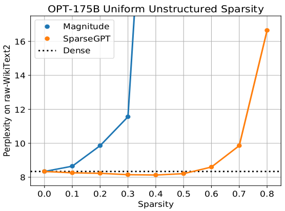
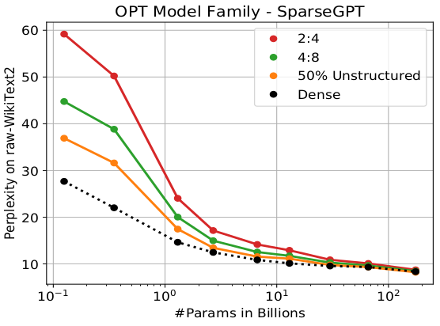
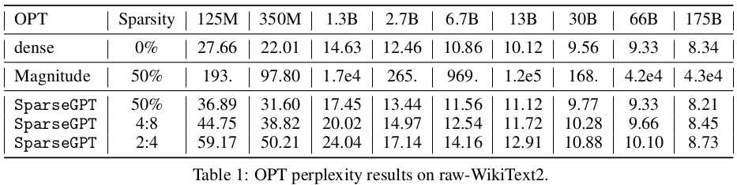

# Sparse-GPT-Massive-Language-Models-Can-Be-Accurately-Pruned-in-One-Shot

Frantar, Elias, and Dan Alistarh. "Massive Language Models Can Be Accurately Pruned in One-Shot." arXiv preprint arXiv:2301.00774 (2023).

## What
A one-shot pruning method

## Why
Models are big.

## How
Based on a new approximate sparse regression solver.

## Notes

* Takes around 4 hours to run it on 175B GPT model with one 80GB A100.
* Induces 50-60% sparsity in one-shot, with minor accuracy loss, measured either in terms of perplexity.
* Magnitude pruning preserves accuracy only until %10 sparsity, and completely collapses beyond %30 sparsity.

* Pruning is layer-wise.

