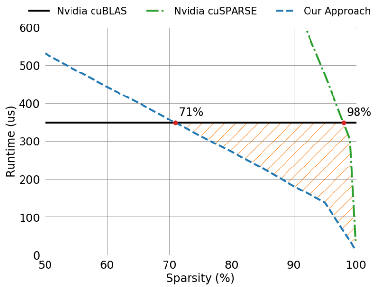

# Sparse GPU Kernels for Deep Learning

Gale, Trevor, et al. "Sparse gpu kernels for deep learning." SC20: International Conference for High Performance Computing, Networking, Storage and Analysis. IEEE, 2020.

## Notes

Link to code: [code](https://github.com/google-research/sputnik)

* Sparse matrix–matrix multiplication runtime for a weight-sparse long short-term memory network problem: Input size 8192, hidden size 2048, and batch size 128 in single-precision on an Nvidia V100 GPU. Sparse computation exceeds the performance of dense at as low as **71% sparsity**.

* Operates directly on the standard compressed sparse row (CSR) format and does not enforce any structure on the topology of nonzero values.
* On average, deep learning matrices are 13.4× less sparse, have 2.3× longer rows, and have 25× less variation in row length within a matrix (compared to SuiteSparse matrices).

* They use cuSPARSE’s **cusparseSpMM** and **cusparseConstrainedGeMM** as the baselines for SpMM and SDDMM benchmarks respectively.

### SpMM

A x B = C

* A is sparse and stored in CSR format.
* B is dense.

### SDDMM

(AxB).C = D

* C and D are sparse.