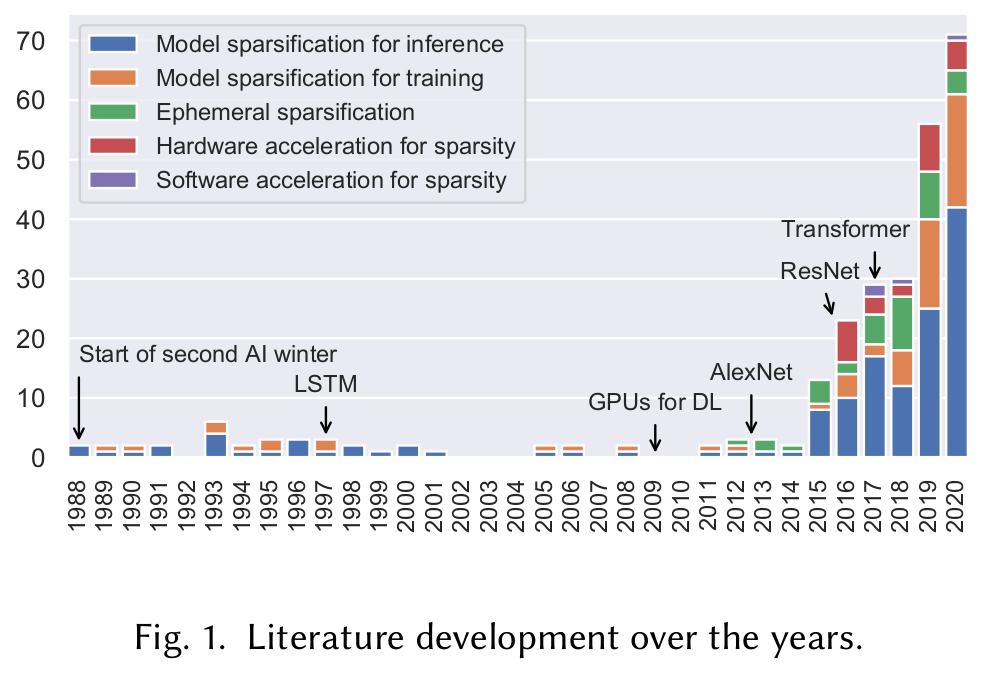
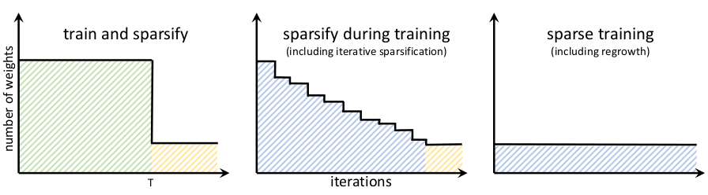
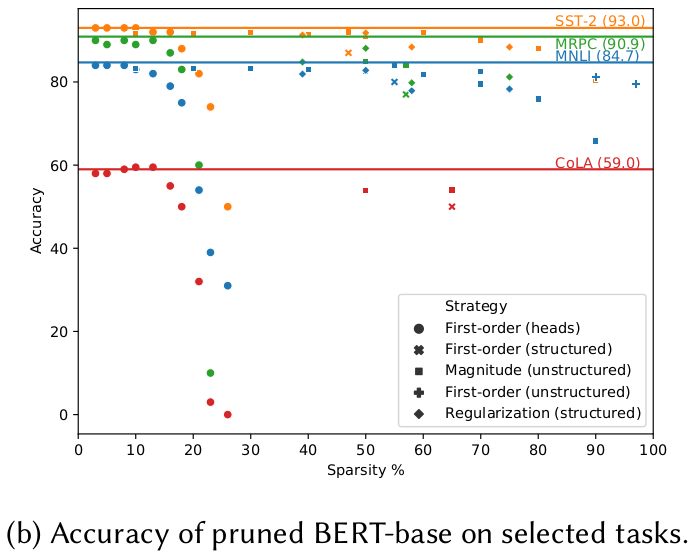

# Sparsity in Deep Learning: Pruning and growth for efficient inference and training in neural networks

## Notes

* Dynamic sparsity combines pruning and regrowth of elements during the training process
* Static sparsity prunes once before the training starts and does not update the model structure during training

