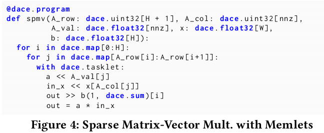
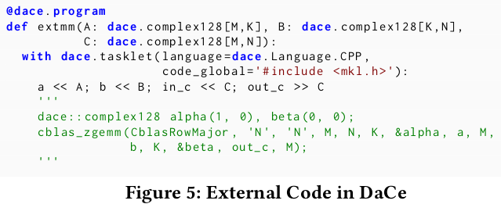

# Stateful Dataflow Multigraphs: A Data-Centric Model for Performance Portability on Heterogeneous Architectures

Ben-Nun, Tal, et al. "Stateful dataflow multigraphs: A data-centric model for performance portability on heterogeneous architectures." Proceedings of the International Conference for High Performance Computing, Networking, Storage and Analysis. 2019.

## Notes

* **Performance Portable** means: Domain scientist's view does not change while the code is optimized to different target architectures.
* It bases on the observation that data-movement dominates time and energy in today’s computing systems.
* Extends existing data-centric mappers with:
  * A multi-level visualization of data movement
  * Code transformation and compilation for heterogeneous targets 
  * Strict separation of concerns for programming roles.

1. The domain programmer works in a convenient and well-known language such as Python. 
2. The compiler transforms the code into an SDFG.
3. Performance engineer works on SDFG, specifying transformations that match certain data-flow structures on all levels (from registers to inter-node communication) and modify them.

### Difference between dataflow and data-centric parallel programming

* Dataflow model execution is stateless (constructs such as loops have to be unrolled).
* Data-centric parallel programming uses **stateful dataflow**. Execution order depends on **data dependencies** and **global execution state**.

* Data-centric model combines the following concepts:
  * Seperating containers from computation (data holding constructs are defined as seperate entities from computations).
  * Dataflow (Information moving from one container to another)
  * States (Constructs that provide a mechanism to introduce execution order independent of data movement)
  * Coarsening (The ability to view parallel patterns in a hierarchical manner, e.g., by grouping repeating computations)

## Domain Scientist View

* Dataflow “intrinsics” can be explicitly defined separately from code with Tasklets.
* Tasklets cannot access data unless it was explicitly moved in or out using predeclared operators (<<, >>) on arrays.

* Can run external code.

## Stateful Dataflow Multigraphs

Directed graph of directed acyclic multigraphs.

* Nodes are containers or computations.
* Edges are data movement (memlet).
* To support cyclic data dependencies, multigraphs reside in **State** nodes. State transition edges on the top-level graph specify conditions and assignments, forming a state machine.

### Containers

Two types:

* **Data node**: Represent a location in memory that is mapped to a multi-dimensional array.
* **Stream node**: Multi-dimensional arrays of concurrent queues.

* Containers are transient (only allocated for the duration of SDFG execution.).

### Computation

* Tasklet nodes contain stateless, arbitrary computational functions.
* Cannot access external memory without memlets.

### Concurrency

* SDFGs expose concurrency by grouping parallel subgraphs (computations, local data, movement) into one symbolic instance, enclosed within two “scope” nodes.
* The subgraphs are connected to external data only through scope nodes.

There two scopes: 

* **Map**: Maps to OpenMP parallel for loops for CPUs, to CUDA kernels for GPUs, and synthesizes different hardware modules as processing elements for FPGAs.
* **Consume**: Enables producer/consumer relationships via streams. Defined by the number of processing elements, an input stream to consume from, and a condition that, when evaluated to true, stops
processing.

## Performance Engineer Workflow

### Graph Transformations

* They provide a standard library of transformations,which is meant to be used as a baseline for performance engineers.
* Transformations can be applied interactively or using Python api.

### DIODE

This is the IDE to guide performance engineers.

### Compilation Pipeline

1. Data dependency inference
2. Code generation
3. Compiler invocation

Rest is performance evaluation.