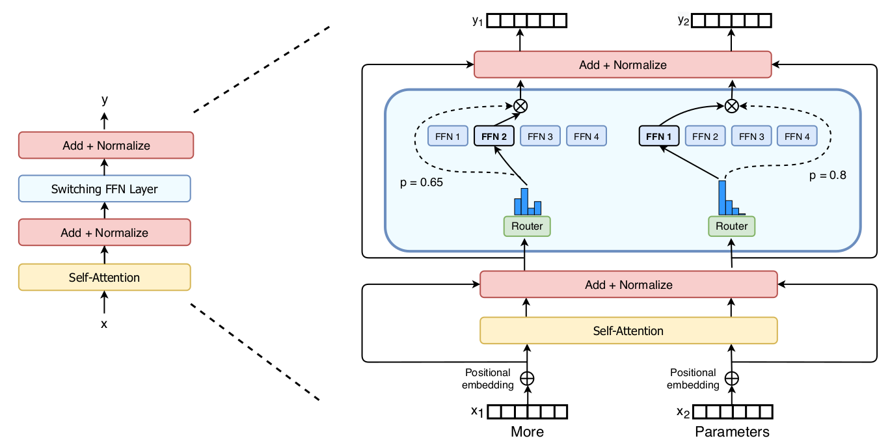

# Switch Transformers: Scaling to Trillion Parameter Models with Simple and Efficient Sparsity

William Fedus, Barret Zoph and Noam Shazeer

## Notes

* The sparsity comes from activating a subset of the neural network weights for each incoming example.
* Goal is to maximize the number of parameters in a transformer.
* Kaplan et al (2020) advocates training large models on relatively small amounts of data as the computationally optimal approach.
* Hypothesis of the paper: the parameter count, independent of total computation performed, is a separately important axis on which to scale
* They make their experiments on TPUs.  

* Benefits:
  * The router computation is reduced as they are only routing a token to a single expert. 
  * The batch size (expert capacity) of each expert can be at least halved since each token is only being routed to a single expert.
  * The routing implementation is simplified and communication costs are reduced