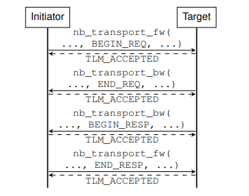
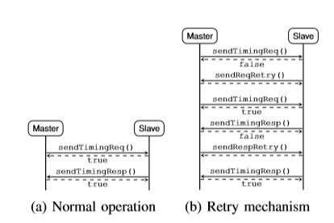
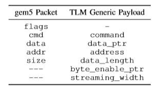
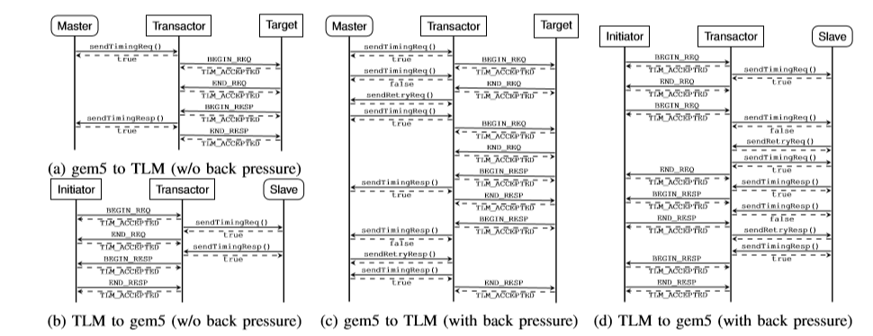

# System Simulation with gem5 and SystemC

C. Menard, J. Castrillon, M. Jung and N. Wehn, "System simulation with gem5 and SystemC: The keystone for full interoperability," 2017 International Conference on Embedded Computer Systems: Architectures, Modeling, and Simulation (SAMOS), Pythagorion, 2017, pp. 62-69.
doi: 10.1109/SAMOS.2017.8344612

## Learn more about the followings:
Heterogenous ISAs.

## Questions:

## Notes:
* SystemC TLM 2.0 has become the main developing tool for virtual prototyping in recent years.
* TLM abstracts the communication mechanism from the hardware.
* TLM encapsulates communication between components in so-called **transactions**.
* Cycle-accurate simulations can be performed in SystemC with commercially available models but these models are **shipped as binary libraries** which makes them useless for microarchitectural research (they cannot be modified).
* The most mature cycle accurate open source system simulator is gem5.
* gem5 is incompatible to TLM models that exist in the industry and academia.
* Paper presents the coupling between SystemC and gem5. 
* Through this coupling, any SystemC module that implements the TLM base protocol can be connected to any gem5 module. 

### Background
#### SystemC and TLM
Although it is possible to model components on the RTL, SystemC is mainly used for high–level system modeling. SystemC extends C++ to provide event-driven simulation. 

TLM is used to model the communication between SystemC components by function calls. Emphasis is on the functionality of the data transfers rather than actual implementation. 

* Modules communicate through sockets. **Initiator sockets** start new transactions and **target sockets** respond to them.
* Initiator modules have one or more initiator sockets and target modules have one or more target sockets. 
* Interconnect modules use both socket types. 
* TLM transactions are encapsulated in the so-called **generic payload** which contains **address**, **command**, **status** and other information along with actual data.
* TLM non-blocking transport consists of: BEGIN_REQ, END_REQ, BEGIN_RESP, END RESP. 
* Two functions handle the communication: 
  1. np_transport_fw transfers a generic payload object from an initiator to a target.  
  2. np_transport_bw transfers a generic payload object from a target an to initiator.

#### gem5

A complete simulation framework. Connect between memory objects is established by binding master and slave ports. Packets encapsulates transfers between memory objects. They contain the actual payload data of memory accesses and metadata (address, size, command, status).

Comparison: 

### Combining gem5 and TLM
The coupling is achieved by hooking the event loop of gem5 to the SystemC kernel. A special SystemC module hosts the gem5 simulation. It is responsible for assembling and initializing all gem5 modules according to a configuration file and implements a process that the SystemC kernel invokes for each gem5 event. 

This is limited since it does not allow communication between gem5 and SystemC modules. The paper **presents a mechanism that translates gem5 memory access to TLM transactions and TLM transactions back to gem5 memory accesses**. They use **slave transactor** to translate gem5 memory accesses to TLM transactions and **master transactor** to translate TLM transactions to gem5 memory accesses.

